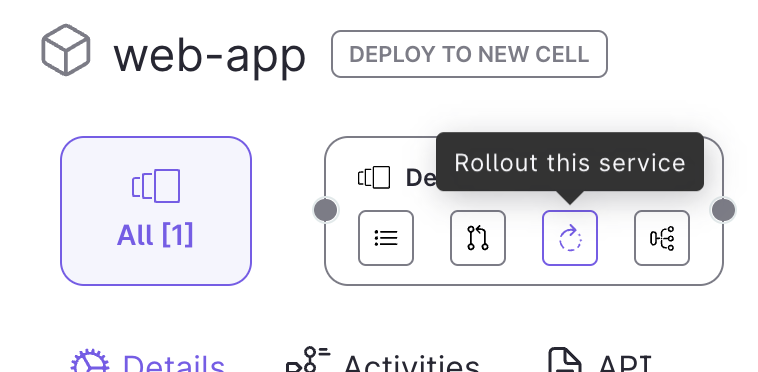

import Alert from '@material-ui/lab/Alert';

# Canary Rollout Quick Start

In this guide we'll give you everything you need to perform a canary rollout of a new Kubernetes service using GitOps best practices, but without needing to write lots of YAMLs!

  <Alert severity="info">
    Although you won't be writing lots of YAML, all of the Argo CD and Rollouts configuration you will generate from the cloud user interface will be visible in the GitHub pull request that is automatically created. You can inspect this YAML before merging the pull request to start the GitOps flow that will rollout your updated service.
  </Alert>

<h3>Contents</h3>

- [Prerequisites](#prerequisites)
- [Overview](#overview)
- [1. Configure GitHub Access](#1-configure-github-access)
- [2. Environment Setup](#2-environment-setup)
- [3. Create a Rollout](#3-create-a-rollout)
- [4. Review & merge PR](#4-review--merge-pr)
- [5. Watch progress](#5-watch-the-rollout-progress-from-ambassador-cloud)

## Prerequisites

All you need to run this quickstart is a GitHub account.

## Overview

The Rollout feature uses:

- A kubernetes cluster: This is where applications are deployed to.
- A git repo: This is used as an interface to allow users to review the deployment (as Pull Requests) before it gets applied in Kubernetes.

In the steps below we provide you all you need to have the full Rollout experience in Ambassador Cloud.

## 1. Configure GitHub Access

Ambassador Cloud needs access to your GitHub account in order to:

- Create a dedicated repository to run rollouts.
- Create PRs for new rollouts in the created repository.
- Configure ArgoCD access to your repo so manifests can be retrieved and applied in the cluster.

Follow the steps below to grant us access to your GitHub:
<Alert severity="warning">
Make sure to sign in to Ambassador Cloud <strong>with your GitHub username</strong> to enable integrations.

</Alert>

1. In Ambassador Cloud, go to the <a href="https://app.getambassador.io/cloud/demo-cluster-rollouts?step=integration" target="_blank">Teams Settings page</a> and click the **Integrations** button for your current team.
1. Click the **Enable** button in the GitHub section, or the **Configure** button in case that you already have the app installed.
1. You will be taken to github.com and asked in which account you want to install Ambassador Cloud.
1. Select your personal account. The personal account is the one that has the same name as your GitHub username.
1. Select the **All repositories** option. Full access is required in order to fork a repo on your behalf for the demo application.
1. Click **Install** and you will be taken back to the Ambassador Cloud.

## 2. Environment Setup

The rollout feature requires/uses a Kubernetes cluster and GitHub repository, please <a href="https://app.getambassador.io/cloud/demo-cluster-rollouts?step=claim" target="_blank" onClick={(e) => {window.open('https://app.getambassador.io/cloud/demo-cluster-rollouts?step=claim', 'ambassador-cloud-rollouts-demo-cluster', 'menubar=no,location=no,resizable=yes,scrollbars=yes,status=no,width=550,height=750'); e.preventDefault(); }}>sign in to Ambassador Cloud to setup your demo cluster.</a>

This will also fork a repository called **emojivoto**.

## 3. Create a Rollout
Go to the <a href="https://app.getambassador.io/cloud/services" target="_blank">Service Catalog</a> page and follow these steps:

1. Filter Services by Favorites (optional)
1. Look for the **web-app** service and click the row to open the Service Details page
1. Choose a cell and click on the rollout button to show the instructions to create a rollout

 

  

Fill in the form with the following information:

- Image Tag: `datawire/emojivoto-web-app v12`
- Rollout Duration: 2 minutes
- Weight increment: 10%
- Number of pods: 3

Click on **Start Rollout**.

<Alert severity="success">Congrats! From the UI you have automatically generated a GitHub pull request that contains all of the necessary Kubernetes rollout YAML configuration.</Alert>

## 4. Review & merge PR

After clicking Start Rollout the slideout will close and you will be shown the service rollouts page where one **Pending** rollout is shown.
Click the **Pull Request** button.
A new browser tab will be opened and you will be taken to github.com where you can review and merge the PR on GitHub.
Click on the **Files changed** tab in the pull request and explore all of the rollouts code that has been generated for you.
Next, click back to the **Conversation** tab, click **Merge Pull Request**, and click **Confirm merge**.
Finally, navigate back to your browser tab with the Ambassador Cloud service catalog to watch the progress. It can take a few seconds for the progress bar to show up.

## 5. Watch the Rollout progress from Ambassador Cloud

From the service rollouts page you can watch the rollout progress of your new version.
Note how the **Current Canary Weight** progress bar increases in steps in the amount you specified above in the "weights increment".

<Alert severity="success">Victory! You have successfully performed a GitOps style canary rollout of a new service without having to write lots of YAML.</Alert>

## What's next?

Explore some of the popular content on canary rollouts:

- [Canary concepts](../../concepts/canary/): Learn more about canary rollouts and Argo
- [Canary rollouts and observability](../../howtos/observability/): Explore how observability is a prerequisite of effective canary releases.
- [Ambassador Cloud Rollouts reference](../../reference/ambassador-cloud-rollouts/): Dive into the details of Argo configurations and Ambassador Cloud rollouts annotations.
