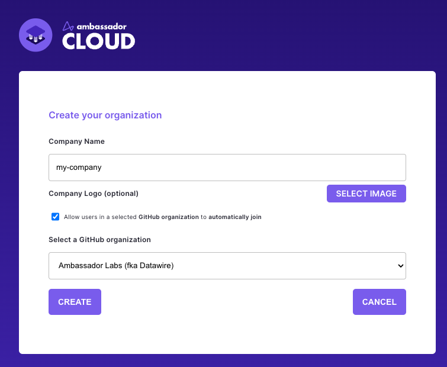

# Authentication Overview
<!-- We may need to add SAML to this list if it releases at the same time or prior to our release. -->
Authenticating with Ambassador Cloud is simple! Choose to authenticate via Google, GitHub or GitLab to get started. 

Once you've selected your provider(GitHub, GitLab or Google), if this is your first ever login, you will be prompted to create a new Organization. 

# Setting up an Organization

Organizations are based on the domain of the email address of the account you choose to sign in with. 
So, if I'm a new user and sign in with `sally@datawire.io`, you will be prompted to create a new Organization for `datawire.io` unless one already exists. 

 

  

When creating your organization you will be asked to upload your company log and enter your company URL so we can customize your experience across Ambassador Cloud. 

 

  

If you are using GitHub or GitLab, you will be asked to define which provider organization we should trust. If your GitHub organization isn't listed there might be an issue with [GitHub settings](#your-github-organization-isnt-listed).

<!-- TODO: add an image of organization idp setup page for GitHub/Gitlab -->

Once you've created your organization you'll be able to continue your login process and proceed to the [Team](#creating-a-team) creation steps.

<Alert severity="info">
  Organizations will only work with custom email domains.
</Alert>

# Joining an already existing Organization

Once an organization has been created for your email domain, any user that signs in with the same domain will be automatically prompted to the team selection page. 

 

  

 

There, you will be able to choose which Team to join and start using Ambassador Cloud. 

Administrators can setup the teams to require an additional acceptance to join, once a user selects the team, the administrators will recieve a notification to either accept or deny entry.

You can join an Organization using GitHub, GitLab or Google:

# Adding a new Team to an already existing Organization

Ambassador Cloud allows you to have many Teams within an Organization.

To add a new team Navigate to your `Settings` Page in Ambassador Cloud, select `Account` and choose the `Create Team` option. 

<!-- TODO: Add screenshot of organization page with create team button -->

You will be redirected back to our login service where you will be prompted with steps to create your new Team. 

<!-- TODO: Add screenshot of create new team page -->

<Alert severity="warning">
  Each Team within Ambassador Cloud is subject to it's own Licenses. See  <a href="../../subscriptions/howtos/manage-my-subscriptions/">Subscriptions</a> for more information.
</Alert>

# Create Teams

Teams are how you will navigate Ambassador Cloud. A Team is where users will sign in within your Organization, clusters will be connected, and give you the ability to use all the features of Ambassador Cloud. 

## GitHub and GitLab as provider

The primary email on your GitHub or Gitlab account must match the domain of the Organization you are trying to join, you will also need to be a member of the GitHub organization.

you will need to select which organization you want to use for your Ambassador Cloud team. 
This organization will be an extra source of truth for granting access to your Ambassador Cloud team.

## Google as provider

This method will not require the primary email to match your domain and you will need to sign in with Google or be invited by an administrator.

# Troubleshooting

## Your GitHub organization isn't listed
Ambassador Cloud needs access granted to your GitHub organization as a third-party OAuth app.  If an organization isn't listed during login then the correct access has not been granted.

The quickest way to resolve this is to go to the **Github menu** → **Settings** → **Applications** → **Authorized OAuth Apps** → **Ambassador Labs**.  An organization owner will have a **Grant** button, anyone not an owner will have **Request** which sends an email to the owner.  If an access request has been denied in the past the user will not see the **Request** button, they will have to reach out to the owner.

Once access is granted, log out of Ambassador Cloud and log back in; you should see the GitHub organization listed.

The organization owner can go to the **GitHub menu** → **Your organizations** → **[org name]** → **Settings** → **Third-party access** to see if Ambassador Labs has access already or authorize a request for access (only owners will see **Settings** on the organization page).  Clicking the pencil icon will show the permissions that were granted.

GitHub's documentation provides more detail about [managing access granted to third-party applications](https://docs.github.com/en/github/authenticating-to-github/connecting-with-third-party-applications) and [approving access to apps](https://docs.github.com/en/github/setting-up-and-managing-organizations-and-teams/approving-oauth-apps-for-your-organization).

### Granting or requesting access on initial login

When using GitHub as your identity provider, the first time you log in to Ambassador Cloud GitHub will ask to authorize Ambassador Labs to access your organizations and certain user data.

 

  

 

Any listed organization with a green check has already granted access to Ambassador Labs (you still need to authorize to allow Ambassador Labs to read your user data and organization membership).

Any organization with a red "X" requires access to be granted to Ambassador Labs.  Owners of the organization will see a **Grant** button.  Anyone who is not an owner will see a **Request** button. This will send an email to the organization owner requesting approval to access the organization.  If an access request has been denied in the past the user will not see the **Request** button, they will have to reach out to the owner.

Once approval is granted, you will have to log out of Ambassador Cloud then back in to select the organization.
