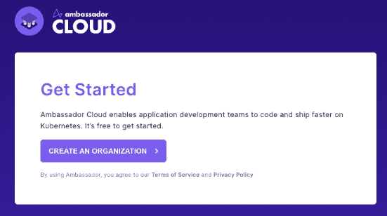
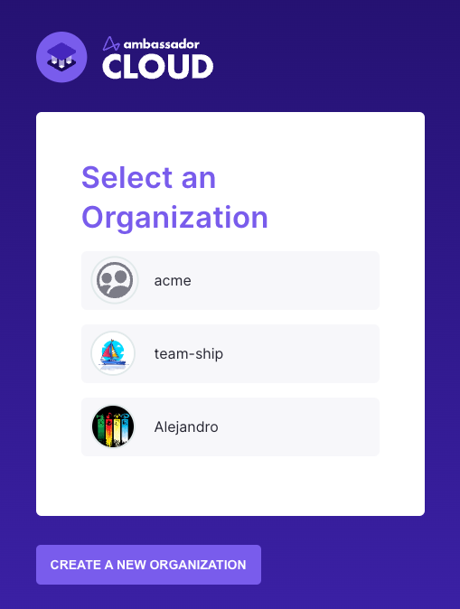
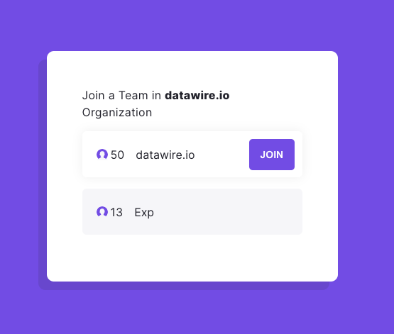
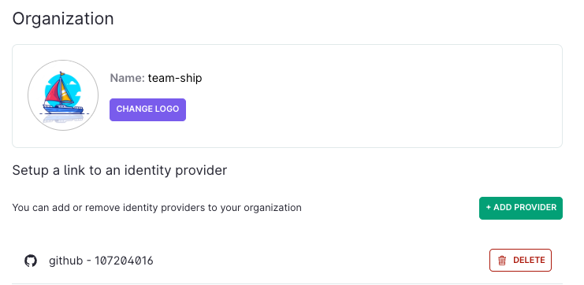
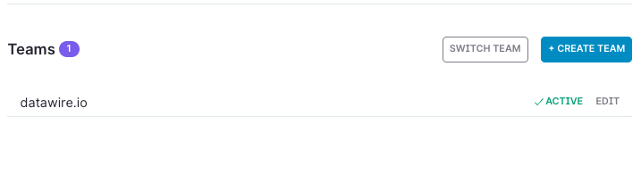

import Alert from '@material-ui/lab/Alert';

# Authentication Overview
<!-- We may need to add SAML to this list if it releases at the same time or prior to our release. -->
Authenticating with Ambassador Cloud is simple: connect with Google, GitHub or GitLab to get started. 

Once you select your identity provider, you're either prompted to create a new Ambassador Cloud organization or asked to join an existing one.

## Setting up an Organization

An [Organization](/docs/cloud/latest/organization/#Organization) represents your tenant in Ambassador Cloud. 

The first thing we'll ask you is to create one:

 

  

When creating your organization you will be asked to set a name for it.

You can also upload your Organization / Company logo so we can customize your experience across Ambassador Cloud.

Moreover, you can enable the automatic join, leveraging an [identity provider (Idp)](/docs/cloud/latest/organization/#identity-providers) like GitHub or GitLab. Any user part of it will be
able to join the Organization without being explicitly invited.

 

  

If using GitHub, and that you're Organization isn't listed, you may want to update the permissions in the [GitHub settings](#your-github-organization-isnt-listed-while-creating-an-ambassador-cloud-organization).

If you want to add more than one Idp to the organization, or are not ready to set one, don't worry, you'll be able to define that later in the user settings.

Once you've created your organization you'll be able to continue your login process and proceed to the [Team](#joining-an-already-existing-organization) selection steps.

## Joining an already existing Organization

Once an organization has been created, any user that signs in using an [identity provider](/docs/cloud/latest/organization/#identity-providers) configured for the auto-join, or who's been invited by email, will be able to connect.

 

  

 

If your organization has more than one team, you'll also see an extra screen to select it:

 

  

 

Otherwise, you'll be immediately redirected to the Cloud App.

## Manage IDPs resources authorized to join the organization

Once you've created your Ambassador Cloud organization, you can at any point in time manage IDPs linked to it.

Navigate to your `Settings` Page in Ambassador Cloud and select `Organization`.

 

  

 

If you need to create a new link, the slideout will ask your organization identifier based on the IDP you've selected :
- **GitHub** : You can find your GitHub Organization identifier by replacing organizationName in this endpoint https://api.github.com/orgs/{organizationName} (You must be logged to GitHub to complete this action)
- **GitLab** : GitLab use groups instead of organizations but it's the same. Once logged in GitLab, use this endpoint https://gitlab.com/api/v4/groups
- **Google**: Use the [primary domain](https://support.google.com/a/answer/182080) defined in your Google Workspace (example: if your email is you@yourbusiness.com, the identifier is yourbusiness.com)

For example, if you add a GitHub organization, all the users who are part of it will be able to join the Ambassador Cloud Organization without any extra work.

## Manage Teams in an already existing Organization

Ambassador Cloud allows you to have many [Team](/docs/cloud/latest/organization/#Team) within an [Organization](/docs/cloud/latest/organization/#Organization).

To add a new team, navigate to your `Settings` Page in Ambassador Cloud, select `Account` and choose the `Create Team` option. 

 

  

 

<Alert severity="warning">
  Each Team within Ambassador Cloud is subject to it's own Licenses. See  <a href="../../subscriptions/howtos/manage-my-subscriptions/">Subscriptions</a> for more information.
</Alert>

A [Team](/docs/cloud/latest/organization/#Team) is a group that users can join within your Organization. Clusters will be connected to the team, and give you the ability to use all the features of Ambassador Cloud. 

## Troubleshooting

### Your GitHub organization isn't listed while creating an Ambassador Cloud organization

Ambassador Cloud needs access granted to your GitHub organization as a third-party OAuth app. If an organization isn't listed during login then the correct access has not been granted.

The quickest way to resolve this is to go to the **Github menu** → **Settings** → **Applications** → **Authorized OAuth Apps** → **Ambassador Labs**.  An organization owner will have a **Grant** button, anyone not an owner will have **Request** which sends an email to the owner.  If an access request has been denied in the past the user will not see the **Request** button, they will have to reach out to the owner.

Once access is granted, log out of Ambassador Cloud and log back in; you should see the GitHub organization listed.

The organization owner can go to the **GitHub menu** → **Your organizations** → **[org name]** → **Settings** → **Third-party access** to see if Ambassador Labs has access already or authorize a request for access (only owners will see **Settings** on the organization page).  Clicking the pencil icon will show the permissions that were granted.

GitHub's documentation provides more detail about [managing access granted to third-party applications](https://docs.github.com/en/github/authenticating-to-github/connecting-with-third-party-applications) and [approving access to apps](https://docs.github.com/en/github/setting-up-and-managing-organizations-and-teams/approving-oauth-apps-for-your-organization).

### Granting or requesting access on initial login

When using GitHub as your identity provider, the first time you log in to Ambassador Cloud GitHub will ask to authorize Ambassador Labs to access your organizations and certain user data.

 

  

 

Any listed organization with a green check has already granted access to Ambassador Labs (you still need to authorize to allow Ambassador Labs to read your user data and organization membership).

Any organization with a red "X" requires access to be granted to Ambassador Labs.  Owners of the organization will see a **Grant** button.  Anyone who is not an owner will see a **Request** button. This will send an email to the organization owner requesting approval to access the organization.  If an access request has been denied in the past the user will not see the **Request** button, they will have to reach out to the owner.

Once approval is granted, you will have to log out of Ambassador Cloud then back in to select the organization.
