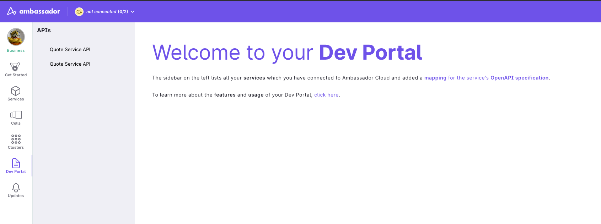
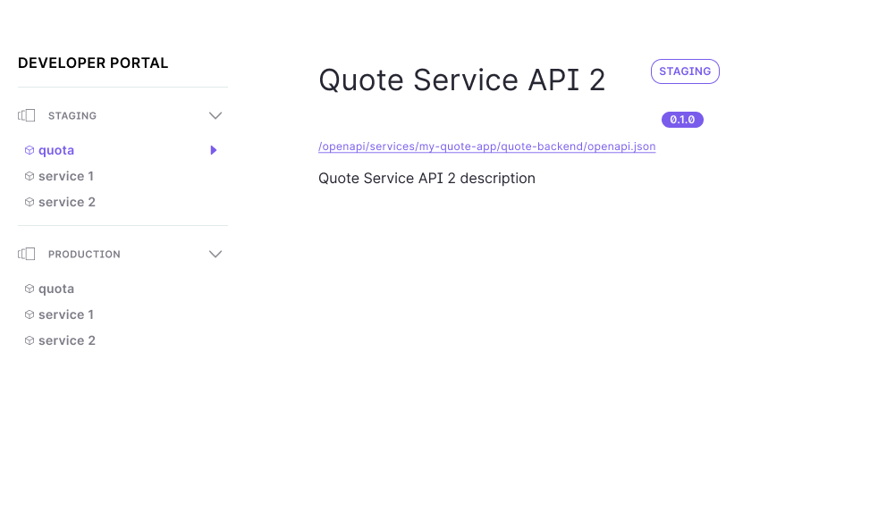

# Ambassador Cloud Developer Portal guide

You will access and explore some of the key features of the Developer Portal in Ambassador Cloud.

<h3>Contents</h3>

* [Prerequisites](#what-is-the-developer-Portal?)
* [1. Connect your cluster to Ambassador Cloud](#features)

## What is the Ambassador Cloud Developer Portal ?

The Developer Portal is a section that allows you to publish reference and API documentation about services in Ambassador Cloud.

## Features

The Developer have the following features:

- Service discovery for all your services connected to Ambassador Cloud.
- API definition of your services.

## Add Open API documentation to Developer Portal

Before exploring the Developer Portal, you first need to report your API docs using Mapping resources. You can follow this [quick start](../visualize-api/quick-start).

## Explore Developer Portal

The [Developer Portal](https://app.getambassador.io/cloud/dev-portal) is accessible in the Cloud using the side navigation menu.

  

    
  

All your services are aggregated by cell name, here you can explore the Open API documentation and try out the services :

  

    
  

## Add API Keys authentication to your services

If you are using Edge Stack, you will soon be able to add API Keys authentication to your service from the Developer Portal.

## Migrating from the Edge Stack Developer Portal

If you have are currently using [Edge Stack Developer Portal](../../../edge-stack/latest/topics/using/dev-portal), you can follow [this guide to migrate](../../../edge-stack/latest/topics/using/dev-portal#migrate-your-old-dev-portal-to-the-cloud) the new Ambassador Cloud Developer Portal.