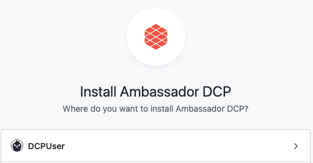

# Configuring Ambassador Cloud for GitOps

Edge Stack and Emissary-ingress are managed declaratively. This approach lends itself well to a [GitOps workflow](../../../../../docs/edge-stack/latest/topics/concepts/gitops-continuous-delivery/). Traditionally, adopting a GitOps workflow requires an extensive amount of engineering. With Ambassador Cloud, you can quickly and easily adopt a GitOps workflow without any custom engineering.

This guide walks through how you can configure Edge Stack or Emissary-ingress with GitHub, integrate checks into your GitOps pull request workflow, create Mapping resources without an IDE, and generate preview URLs to share unreleased changes in opened pull requests with your colleagues.

## 1. Connect your cluster to Ambassador Cloud

<Alert severity="info">
  If you followed the <a href="/docs/edge-stack/latest/tutorials/getting-started/">Edge Stack quick start</a>, you can skip this step.
</Alert>

1. Log in to [Ambassador Cloud](https://app.getambassador.io/cloud/) with your preferred identity provider.

2. Click **Add Services** at the top, then click **Connection Instructions** in the `Connect your installation` section.

3. Follow the prompts to name the cluster and click **Generate a Cloud Token**.

4. Follow the prompts to install or configure version 2.2 or later of either Edge Stack or Emissary-ingress with a cloud token into your Kubernetes cluster.

   If you do not have the latest version installed, you can:

   * [Install the latest version of Edge Stack](/docs/edge-stack/latest/topics/install/)
   * [Upgrade Edge Stack to the latest version](/docs/edge-stack/latest/topics/install/upgrading/)

5. Once the installation is complete, services, environments, and clusters are visible in Ambassador Cloud.

<Alert severity="success"><b>Victory!</b> All the Services running in your cluster are now listed in Service Catalog!
You can now see all running services in your cluster at <a href="https://app.getambassador.io/cloud/services" target="_blank">https://app.getambassador.io/cloud/services</a> </Alert>

## 2. Configure the GitHub integration

1. Navigate to the <a href="https://app.getambassador.io/cloud/settings/teams" target="_blank">Teams Settings page</a> in Ambassador Cloud.

2. Click the **INTEGRATIONS** button to navigate to the Integration settings, then click the **CONFIGURE** GitHub settings button.

3. Click **MANAGE PERMISSIONS** button. This takes you to github.com where you can choose which account you want to install Ambassador Cloud.

4. Select the account that contains the git repositories with your Kubernetes manifest files and your application code.

    

    Configure the installation for the desired repositories:

    

    After clicking **Install**, you will be directed back to Ambassador Cloud.

5. Once back in Ambassador Cloud, click the **CONFIGURE** GitHub settings button once more and find the target git repository in the list. Click **ENABLE INTEGRATIONS**.

6. Configure Ambassador Cloud to access your cluster information and Kubernetes manifests from Git.

    In the `manifest` text box, enter the relative path to your Kubernetes manifest files in your repository.

    Select the cluster you initialized in step 1 from the `cluster` dropdown.

7. Click the **UPDATE REPOSITORY SETTINGS** button. This triggers Ambassador Cloud to create a pull request with the information you just entered into your git repository. The pull request adds a file named .a8r.yaml to the root of your repository. The contents will look something like this:

    ```
    k8s_config:
    - manifest_path: /manifests/
      cluster_info:
        cluster_id: 01234567-89ab-cdef-0123-456789abcdef
        cluster_name: My Awesome Cluster
    ```

8. Merge the pull request to the main branch of the git repository.

<Alert severity="success"><b>Congrats!</b> Your GitOps repository is now configured.</Alert>

## What's Next?

Activate your GitOps integration by:
- [Automating configuration analysis](../../config-analysis/quick-start).
- Opening pull requests for Mappings created in the [Ambassador Cloud UI](https://app.getambassador.io/cloud/services).
- [Generating preview URLs for your pull requests](../../deployment-previews/quick-start).
