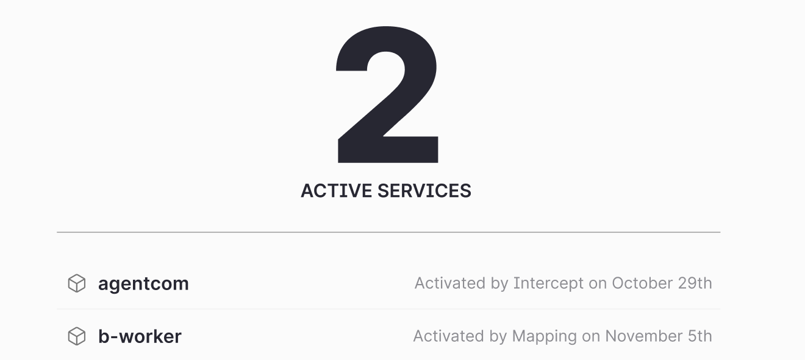

# Onboarding Dashboard

Invite and onboard all your developers and see their actual onboarding process.

## Onboarding Overview

See all your onboarded developers and those yet to be onboarded.

  

  

- **Invite more people:** Invite your colleagues to collaborate.
- **Developers onboarded:** See the number of people already onboarded.
- **Need to be onboarded:** List of people waiting to be onboarded.
- **Active services:** All your company's active services are shown here.
