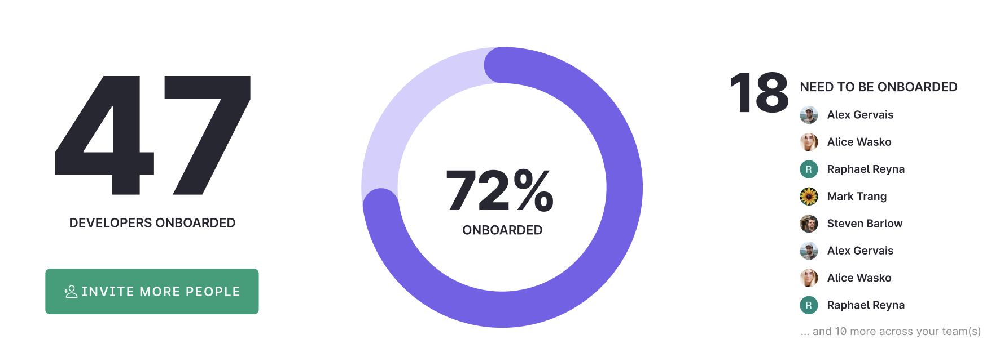

# Onboarding Dashboard

A central location to check the status of your developers, along with the services within your organization, or the count of telepresence connections to your clusters, depending on your subscription type.

## Onboarding Overview

All members of your organization have the ability to access the dashboard, where they can clearly identify invited developers who have not yet joined, as well as those who have. Furthermore, from this dashboard, you can send invitations to new developers (excluding Developer and Lite subscriptions).
In addition to this, easy access is provided to information about your clusters, as well as the features developed by Ambassador.

  

- **Connects:** Total telepresence connections made to your clusters.
- **Active services:** Your services that are currently flagged as `active`, how they were activated, and the last seen date.Legacy</span
- **Clusters:** Your clusters set up through Ambassador Cloud.
- **Features:**  Additional functionalities that Ambassador provides for you and your organization.

Team members section is  available for all subscriptions except Lite and Developer:
- **Invite more people:** Invite your colleagues to collaborate, send an email invitation link to start the Ambassador Cloud experience.
- **Re-Invite people:** Resend the invite to colleagues that didn't accept the first invite.
- **Developers onboarded:** See the number of people that have created or initialized an intercept.
- **Need to be onboarded:** List of people who have not created any intercept. You can nudge them to send some useful email with instructions about how to start.
