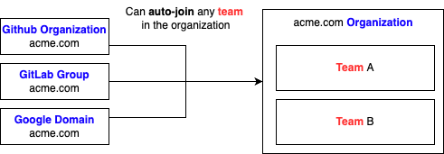

import Alert from '@material-ui/lab/Alert';

# Organization

An Ambassador Cloud organization is a space where multiple engineers can collaborate. Each organization acts as a container, aggregating one or multiple [Ambassador Cloud teams](##Team) that you're able to configure according to your needs.

## Team

An Ambassador Cloud team is a dedicated space for your specifc team to enjoy Ambassador Cloud features. Users that are part of your Ambassador Cloud organization have access to all the Ambassador Cloud teams inside the organization. You're also able to invite external users to a specific team by navigating to the `Settings` page.

## Identity Providers

An <b>identity provider</b> (IDP) is a service that stores and manages digital identities. Ambassador Cloud organizations can be linked to the following IDPs: 
* GitHub
* GitLab
* Google
* SAML (_available only in enterprise plans_)

As a result, each user part of these providers will be able to join the Ambassador organization without being invited. 

<Alert severity="info">
  You can choose to <b>not</b> enable this feature, and to invite each user manually using their email.
</Alert>

The following schema summarizes how these resources interact with each other:

 

  

 

To setup your organization, see the [dedicated section of our user guide](/docs/cloud/latest/authenticating).

[This is just a test](.../authenticating/)

