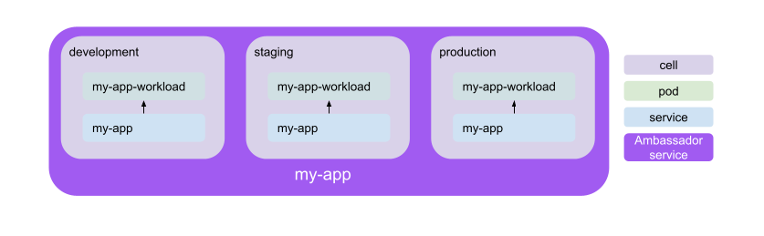
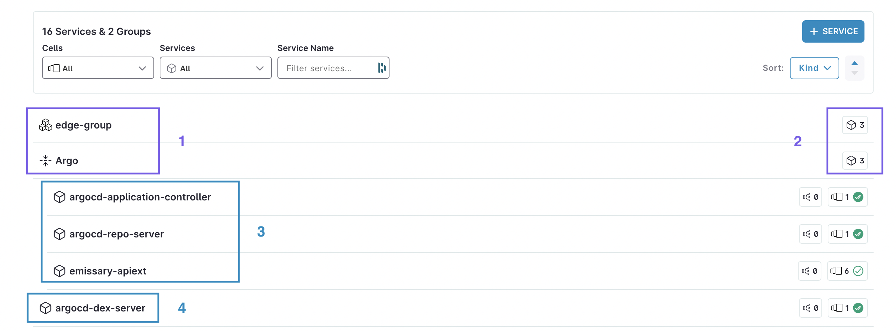

# Service Catalog

Ambassador Cloud's default landing page is the service catalog. This displays all the Kubernetes services in your connected clusters.

The service catalog allows you to see the basic details for each of your [services](/docs/cloud/latest/service-catalog/concepts/services) and service groups.

## Services

A Kubernetes service is an exposed application running on a workload (pods). It is an entrypoint to a version of your deployed application with an IP address and a port.

In the Service Catalog, each Ambassador Service represents a collection of Kubernetes services that may be in multiple environments. You can see these Ambassador Services represented across all environments on the [cells](/docs/cloud/latest/service-catalog/howtos/cells) page.

## Service Groups

You can group [services](/docs/cloud/latest/service-catalog/concepts/services) together in Service Groups to organize them according to the needs of your workflow. These groupings allow you to easily visualize and manage any of the multiple services that exist across your environments.

1. Both "edge-group" and "Argo" are services. Click on a service group to expand it and show the list of services grouped within.
2. The number on the right shows the number of services contained within each service group.
3. The three services, "argocd-application-controller", "argocd-repo-server", and "emissary-apiext" are included in the expanded Argo service group. 
4. Unliked the services in the service groups above, "argocd-dex-server" in an individual, ungrouped service.
