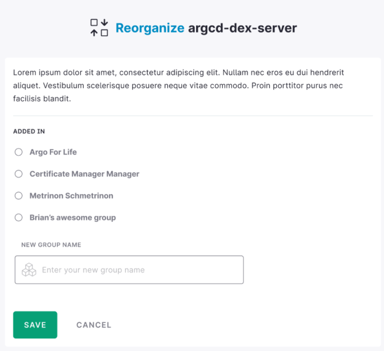
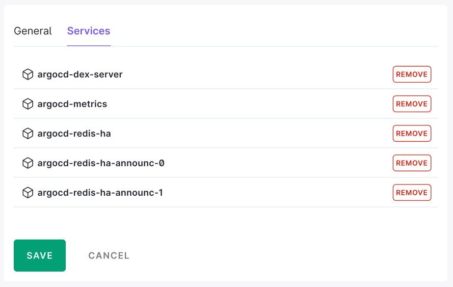
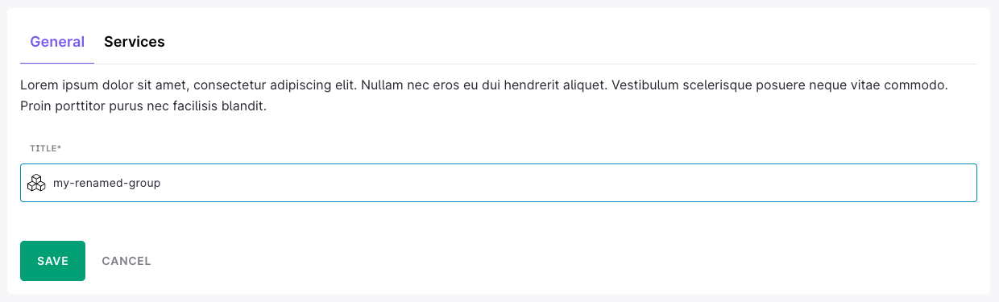

# Organize the service catalog

Microservice applications may span many namespaces or environments making them difficult to visualise and manage. The service catalog allows you to list all of your services so that they are organised and accessible in a single place. This guide describes how to use [service groups](/docs/cloud/latest/service-catalog/concepts/service-groups) to help you to visualize and manage your environments.

## Identify the services you want to group together

Services can be logically grouped together based on your needs. The most common use case is to group
services which are related to a group of functionalities or a specific application.

Taking the example of a database working as a multi-node cluster, you may have:

* **database-primary**
* **database-read-replicas**
* **database-admin**

It would be a good idea to group all of them under a **database** group.

## Add a service to a group

1. Hover the mouse on a service that does not belong to a group, and click on the **move to group** option.

  

    
  

2. Select an existing group, or click on **new group** to add a one and name it. Then click on **save**.

  

    
  

## Remove a service from a group

1. Hover over a group and click **manage this group** to edit it.

  

    
  

2. Select the **services** tab and click **remove** to remove services from the group.
  
  

    
  

3. Click **save** to apply the changes. The group is automatically deleted if there are no more services in it.

## Rename a group.

1. Hover over a group and click **manage this group** to edit it.

  

    
  

2. Select the **general** tab, enter a new name for your group.
  
  

    
  

3. Click **save** to apply the changes.
