# Single Sign On Overview

XXX: It may make sense to combine this and the Ship team docs under a single section, but for the
moment to avoid merge conflicts this will be a separate section.

Ambassador Cloud supports Single Sign on via SAML 2.0. In order to configure Single Sign On you will
need to contact a member of the <a href="/about-us/support">Ambassador Support team</a>.

# Setting up Single Sign on with Okta

## Prerequisites

- Admin access to the Okta tenant for your organization.
- Your unique company ID provided by Ambassador Support.

## Step 1: Create an Okta Application

1. Go to the Okta Admin console for your Okta tenant:

  

    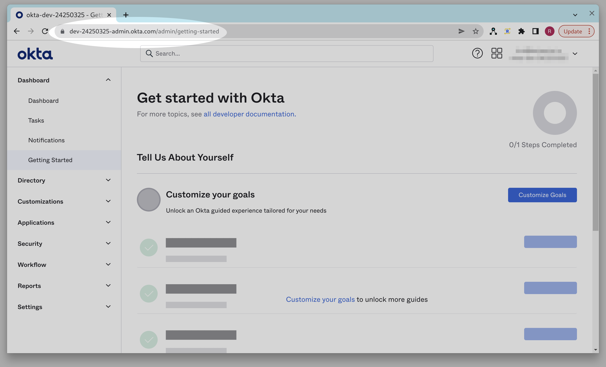
  

2. Click on the "Applications" link:

  

    
  

3. Click "Create App Integration":

  

    
  

4. Choose "SAML 2.0" and click "Next":

  

    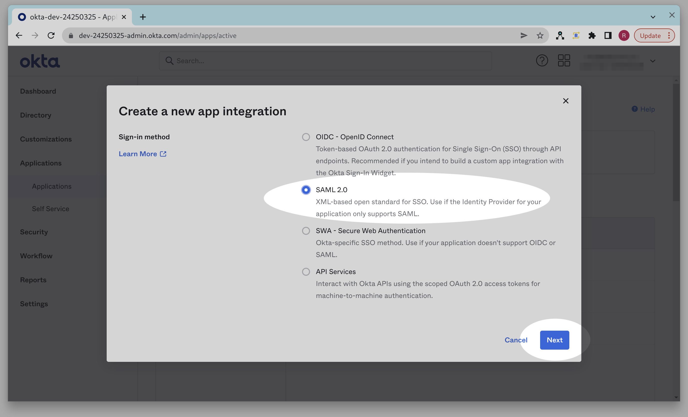
  

5. Enter "Ambassador Cloud" as the app name, enter a logo if desired, and click "Next":

  

    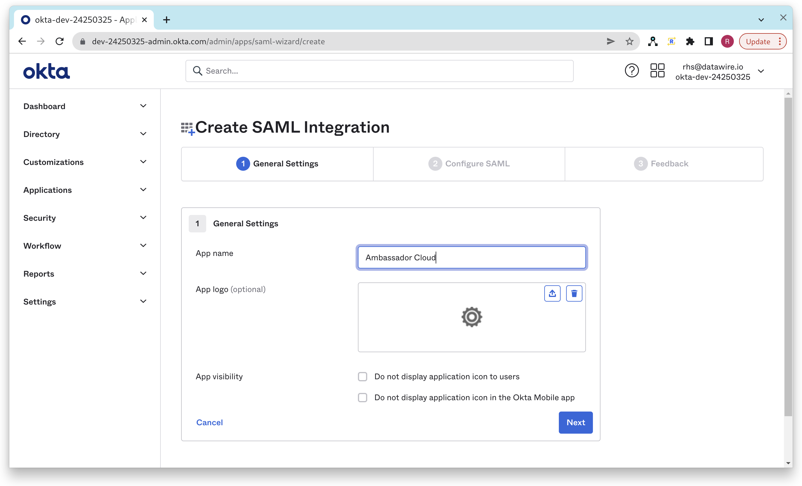
  

6. Enter "https://app.getambassador.io/auth/realms/production/broker/&lt;company-id&gt;/endpoint/clients/&lt;company-id&gt;" for the "Single Sign On URL" field:

  

    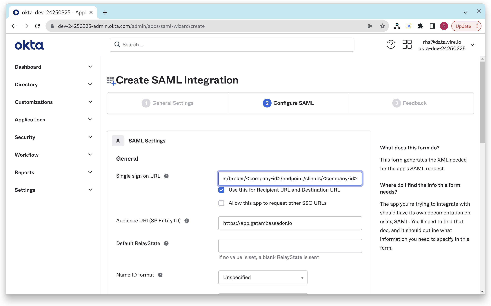
  

7. Enter "https://app.getambassador.io" for the "Audience URI (SP Entity ID)" field:

  

    
  

8. Click Next to continue:

  

    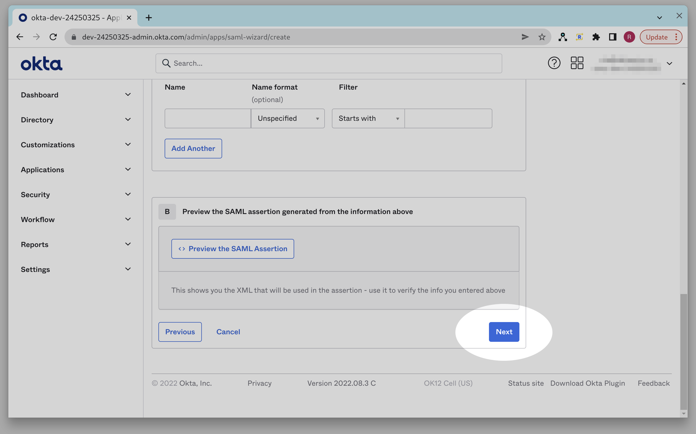
  

9. Click Finish to create the Application Integration:

  

    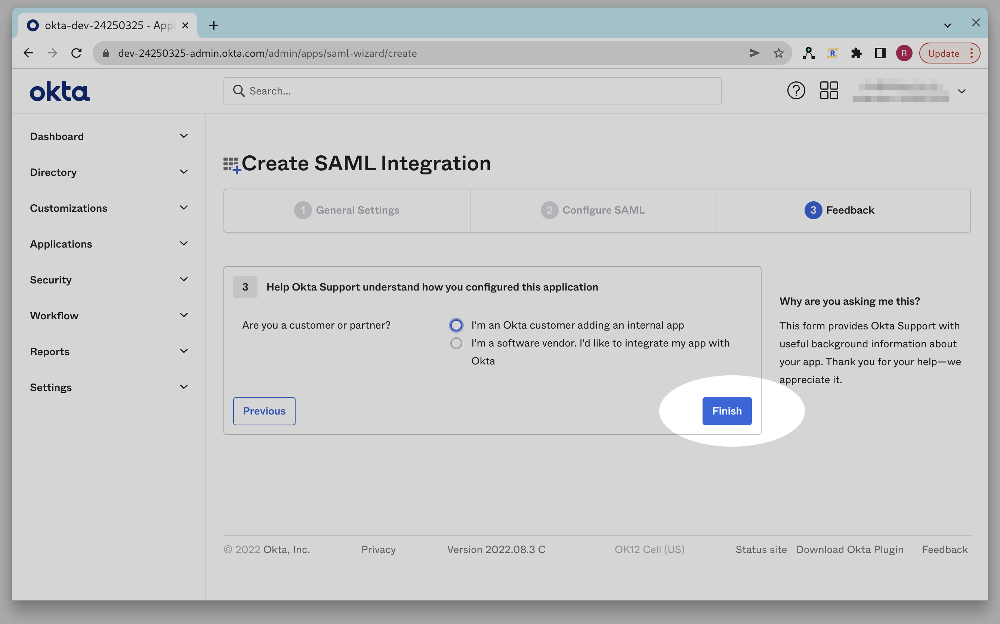
  

When your Application Integration is created you should be in the "Sign On" tab of your Okta App
Integration. If for some reason you aren't there, you can navigate back there by clicking on the
"Applications" tab in the Okta Admin console and then clicking on the Application Integration named
"Ambassador Cloud", and then clicking on the "Sign On" tab:

  

    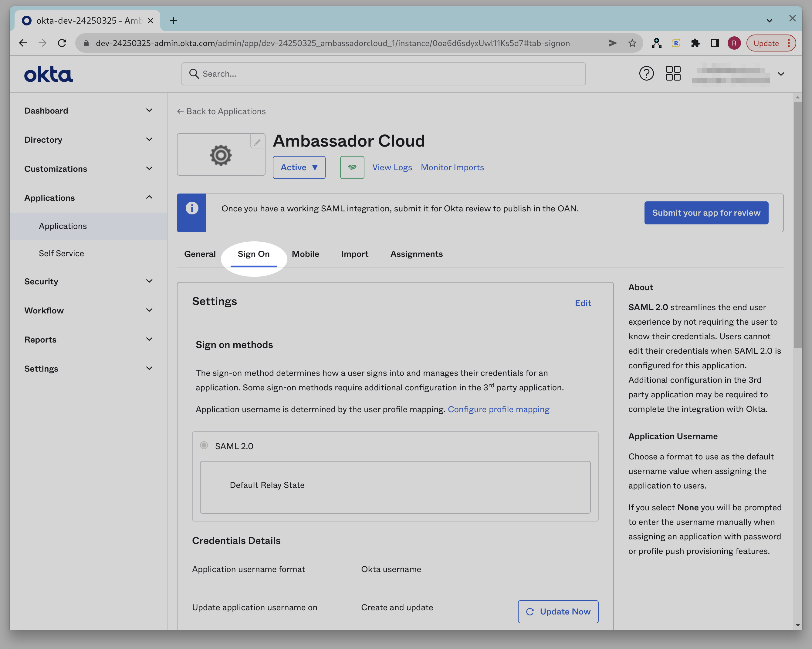
  

From the Sign-On tab click "View SAML setup instructions". You may need to scroll down to see the
"View SAML setup instructions" button:

  

    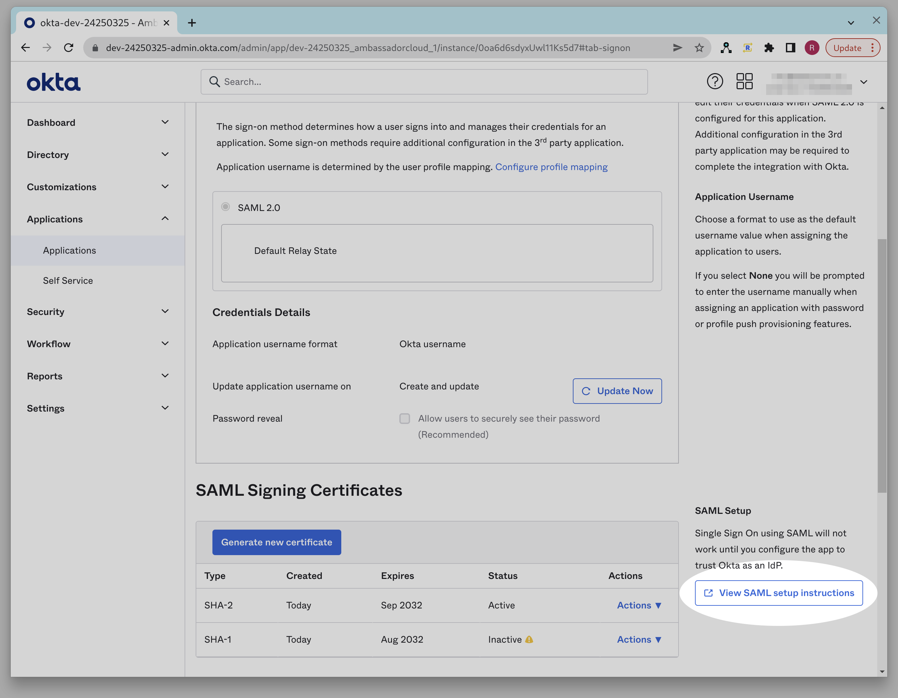
  

Once you are on the "SAML setup instructions" page, please provide the following items to your
Ambassador Support contact:

1. The "Identity Provider Single Sign-On URL"
2. The "Identity Provider Issuer"
3. The "X.509 Certificate"

  

    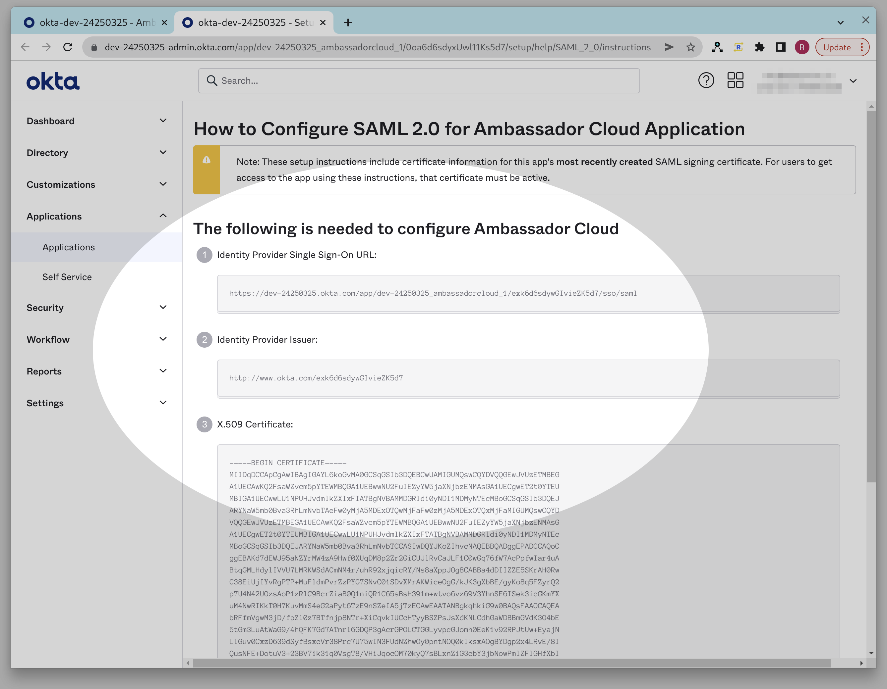
  

Alternatively, you can cut & paste the "IDP metadata XML" at the bottom of the page, which includes
all three of the above items:

  

    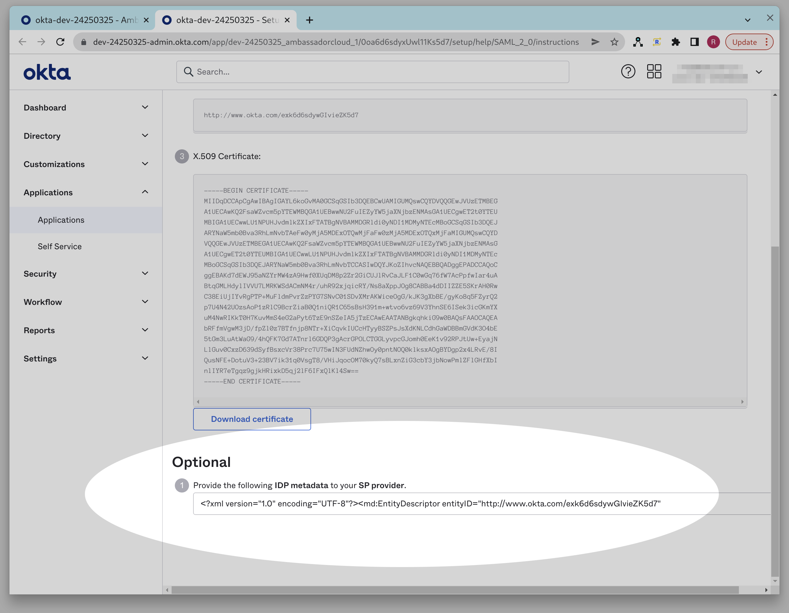
  

## Step 2: Assign your Application Integration to People/Groups

In order to do this, you need to add a Person or Group to the app integration:

1. Go to the Okta Admin console for your Okta tenant:

  

    
  

2. Click on the "Applications" link:

  

    
  

3. Click on the "Ambassador Cloud" integration:

  

    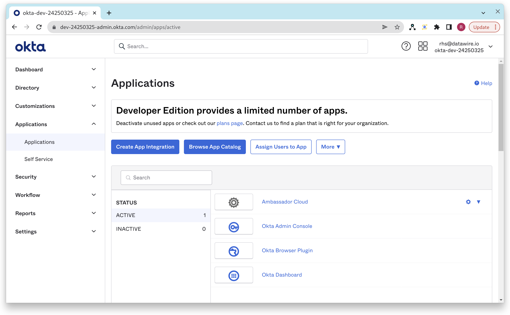
  

4. Click on the "Assignments" tab:

  

    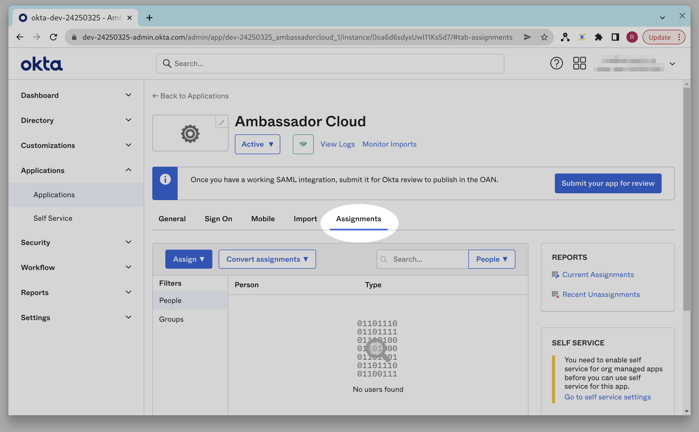
  

5. Click on the "Assign" button and choose either "Assign to People" or "Assign to Group". This will
   determine who is permitted to login to the Ambassador Cloud application.

  

    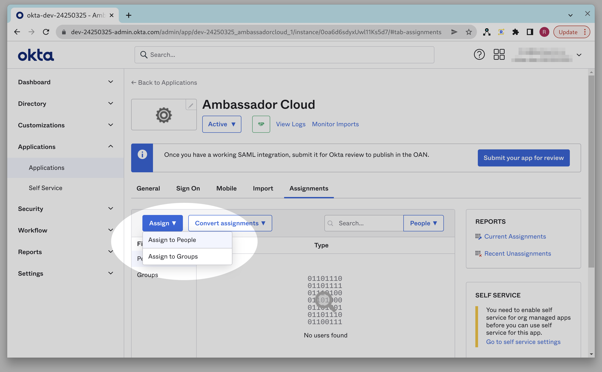
  

## Step 3: Test your Application Integration

Once your support contact has notified you that your SSO integration has been activated, you will
want to test it to ensure that it is working properly. If either of these tests do not proceed as
expected then please schedule a live debug session with your Ambassador Support contact.

There are two cases to test, both Identity Provider initiated Sign On and Service Provider initiated
Sign On. For testing each case you should ensure that you are starting from a logged out browser
with clean state by creating a new incognito session for each test.

### Testing IdP initiated Sign On

1. Go to your user's end user dashboard. If you are on the Okta Admin Console you can reach this by
   clicking on the 4 little squares next to your username in the upper right hand corner of the
   page:

  

    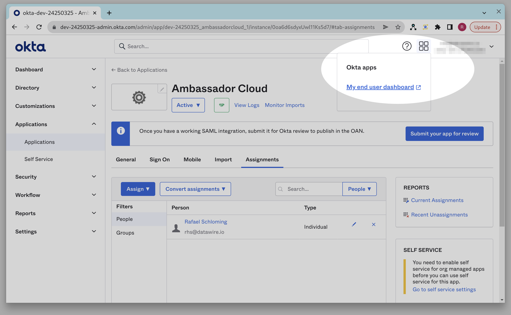
  

2. You should see the Ambassador Cloud application on your dashboard. If you do not then make sure
   your user is added to the Application Integration as described in Step 2:

  

    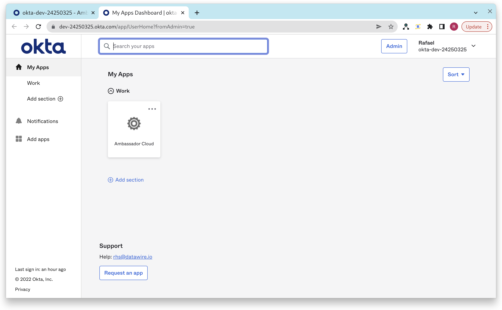
  

3. Click on the Ambassador Cloud application. You should end up at the Ambassador Cloud website and
   already be logged in.

### Testing Service Provider initiated Sign On

XXX: each of these steps should have a screen shot that calls out the required action

1. Go to https://app.getambassador.io
2. At the login page click on the SSO link.
3. Enter your company ID.
4. You should be prompted for your Okta login credentials.
5. Upon entering the correct credentials, you should be logged into the Ambassador Cloud app.
