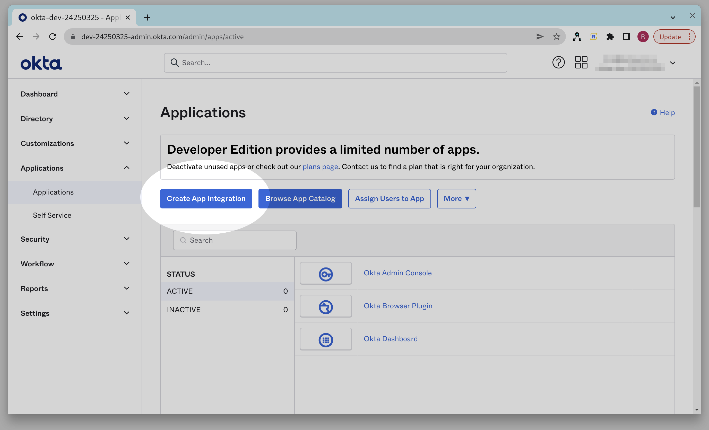
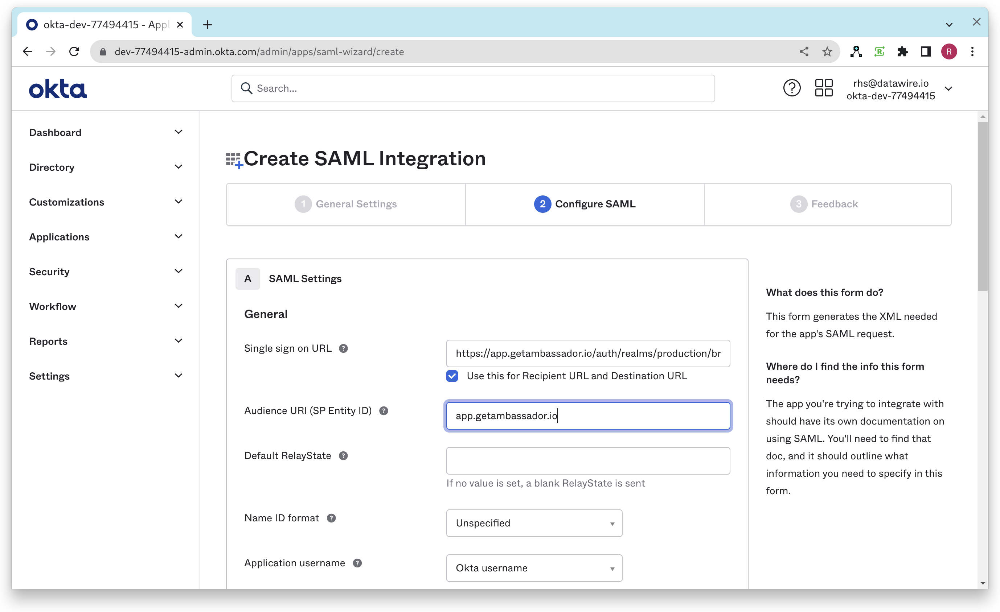
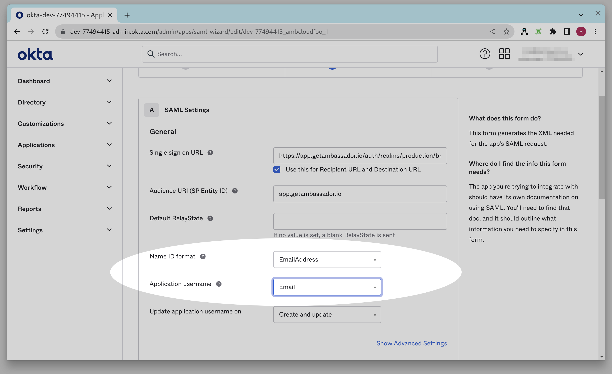
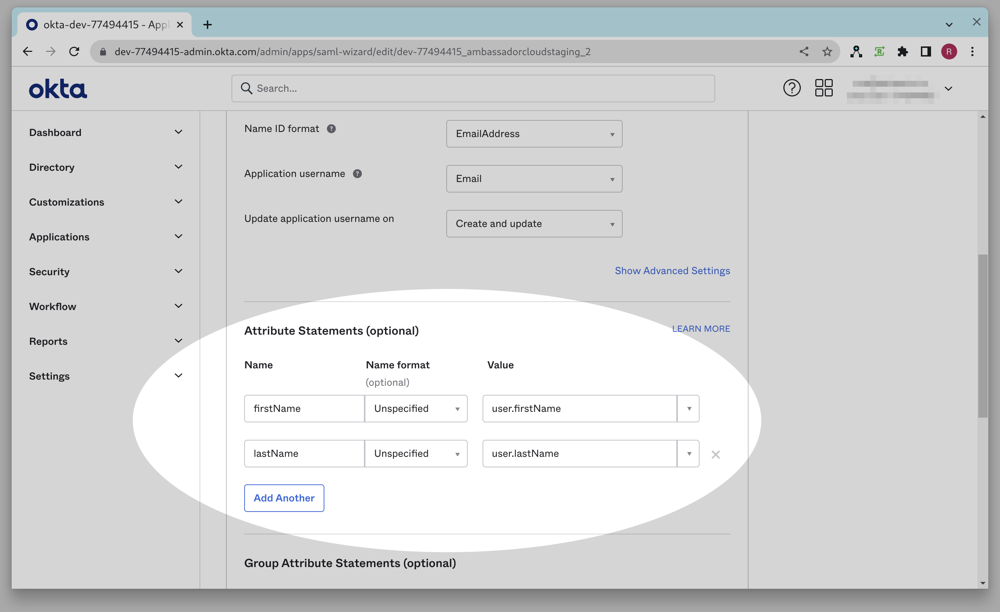

import NewSsoUrl from './SsoUrl.js'
import NewCopy from './Copy.js';

# Single sign-on setup

Ambassador Cloud supports single sign-on via SAML 2.0. In order to configure single sign-on you will
need to contact a member of the <a href="/about-us/support">Ambassador Support team</a>.

## Single sign-on with Okta prerequisites

- Ambassador Cloud Enterprise Subscription.
- Admin access to the Okta tenant for your organization.
- Your unique case sensitive company ID provided by Ambassador Support.

## Step 1: Create an Okta application

1. Go to the Okta Admin console for your Okta tenant.

  

    
  

2. Click on **Applications** in the left nav bar.

  

    
  

3. Click **Create App Integration**.

  

    
  

4. Select SAML 2.0 and then click **Next**.

  

    
  

5. Enter <NewCopy content="Ambassador Cloud"/> as the app name, upload the <a href="../images/ambassador_420_120.png">Ambassador Logo</a>, and click **Next**.

  

    
  

6. <NewSsoUrl/>

7. Enter the above URL (after inputting your case sensitive company ID) into the single sign-on
   URL field.

  

    
  

8. In the Audience URI (SP Entity ID) field, enter <NewCopy content="app.getambassador.io"/>.

  

    
  

9. In the Name ID format dropdown menu, select **EmailAddress**, and in the Application Username dropdown menu, select **Email**.

  

    
  

  
10. Add the following Attribute Statements:

  <ul>
    <li>Attribute <NewCopy content="firstName"/>, format Unspecified, with a value of <NewCopy content="user.firstName"/></li>
    <li>Attribute <NewCopy content="lastName"/>, format Unspecified, with a value of <NewCopy content="user.lastName"/></li>
  </ul>

  

    
  

11. Click **Next** to continue.

  

    
  

12. Click **Finish** to create the Application Integration.

  

    
  

When your Application Integration is created you should be in the Sign On tab of your Okta App
Integration. If for some reason you aren't there, you can navigate back there by clicking the
**Applications** tab in the Okta Admin console. From there, click the Application Integration named
**Ambassador Cloud**, then click the **Sign On** tab.

  

    
  

From the Sign-On tab click **View SAML setup instructions**. You may need to scroll down to see this button.

  

    
  

Once you are on the SAML setup instructions page, please provide the following items to your
Ambassador Support contact:

1. The Identity Provider Single Sign-On URL
2. The Identity Provider Issuer
3. The X.509 Certificate

  

    
  

Alternatively, instead of supplying each of the above 3 items to your support contact individually,
you can cut & paste the contents of the IDP metadata XML text field at the bottom of the page, which includes all three of the above items, and supply this XML to your Ambassador Support contact.

  

    
  

## Step 2: Assign your application integration to people or groups

In order to do this, you need to add a person or group to the app integration:

1. Go to the Okta Admin console for your Okta tenant:

  

    
  

2. Click the **Applications** link:

  

    
  

3. Click Ambassador Cloud integration:

  

    
  

4. Click on **Applications** in the left nav bar.

  

    
  

5. Click the **Assign** button and choose either **Assign to People** or **Assign to Group** from the dropdown. This determines who is permitted to login to the Ambassador Cloud application.

  

    
  

## Step 3: Test your application integration

Once your support contact has notified you that your SSO integration has been activated, you will
want to test it to ensure that it is working properly. If either of these tests do not proceed as
expected then please schedule a live debug session with your Ambassador Support contact.

There are two cases to test, both Identity Provider initiated Sign On and Service Provider initiated
Sign On. For testing each case you should ensure that you are starting from a logged out browser
with clean state by creating a new incognito session for each test.

### Testing IdP initiated sign-on

1. Go to your user's end user dashboard. If you are on the Okta Admin Console you can reach this by
   clicking on the 4 little squares next to your username in the upper right hand corner of the
   page:

  

    
  

2. You should see the Ambassador Cloud application on your dashboard. If you do not then make sure
   your user is added to the Application Integration as described in Step 2:

  

    
  

3. Click on the Ambassador Cloud application. You should end up at the Ambassador Cloud website and
   already be logged in.

### Testing service Provider initiated sign-on

1. Go to https://app.getambassador.io
2. At the login page click on the SSO link.
3. Enter your case sensitive company ID.
4. You should be prompted for your Okta login credentials.
5. Upon entering the correct credentials, you should be logged into the Ambassador Cloud app.
