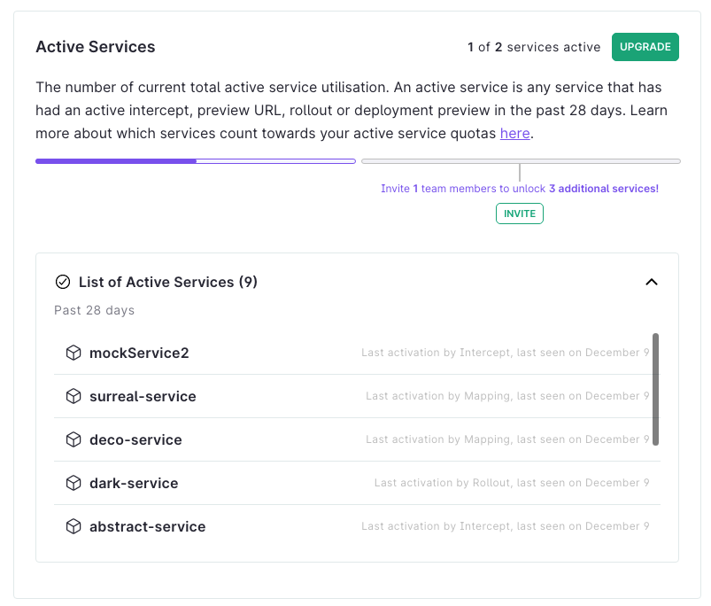

import Alert from '@material-ui/lab/Alert';

# Manage my subscriptions

Ambassador Labs provides a variety of different subscription options depending on your needs. Whether you're working with a small team with a few developers or a company with a large number of services, Ambassador Labs has flexible subscription options, catering to the needs of both teams and individual developers, for you to choose from.

## Check or upgrade your subscription

In user settings, go to the **Subscriptions** section.

The Subscription section of the Settings page shows your current utilization of Ambassador Cloud and the limits of your plan. Teams Edition subscribers can see their payment history here as well. If you’re nearing any of the quota limits, you can upgrade your subscription tier on this page. To learn more about the upgrade process, see the [upgrade your plan section](#upgrade-your-plan) below.

  

    
  

## Quota types

Quota limits are applicable to subscriptions:

- Telepresence Connect: Time you are connected with Telepresence to your cluster.
- Connected Clusters: The Kubernetes clusters you have connected to the Ambassador Cloud app.
- Requests per Second: Requests per second (RPS) is the maximum usage in the cluster between Rate Limited Traffic and Authenticated Traffic. For multiple clusters, RPS is the sum of the maximum usage of each cluster. RPS is calculated from a database snapshot sent by Edge Stack every 30 seconds.
- Team Members: Ambassador Cloud users who have accepted an invitation sent by you through the Members page in your account settings.Legacy
- Active Services: Active services are those which have had an action performed on them within the last 28 days. Actions include intercepts, rollouts, and mappings.Legacy

### Active Services Legacy

You can see which of your services are counting against your subscription by clicking **view actives services** in the Active Services panel. If you delete your service and recreate it with the same name and in the same namespace, it will still count as 1 active service.

The active services list shows the services that have had intercepts, rollouts, or mappings in your organization for the last 28 days.

  

    
  

## Extend your quotas by adding more users

On the Free subscription tier, you can unlock additional quotas by adding more team members to your organization. On the subcription page, click the INVITE button and follow the listed steps to invite new team members and gain access to additional clusters for free.

 

  

## Quota limits

Once you've reached a quota limit, you need to upgrade your plan to add more clusters or extend your connect time. When the quota limit is reached, the following message is displayed:

  

    
  

## Upgrade your plan

If a quota does not fit your requirements, click **upgrade** to increase your quotas.

This opens the following page:

  

    
  

Once you have identified a more suitable subscription plan, click on **Buy Now** to be redirected to the checkout page, or **Contact Us** to talk to us about the details of the Enterprise plan.

### Example

For instance, the subscription page indicates a request per second quota, allowing up to 5 rps. When you reach this limit, you have to upgrade your plan to raise the quota.

  

    
  
