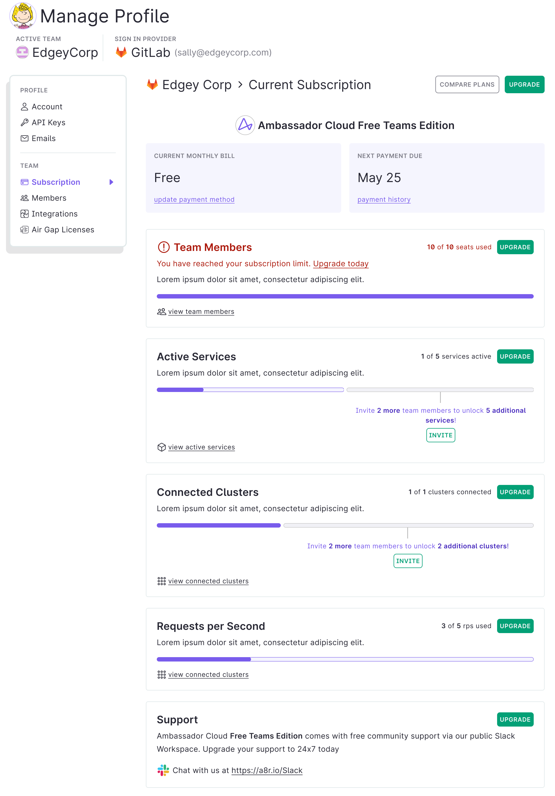
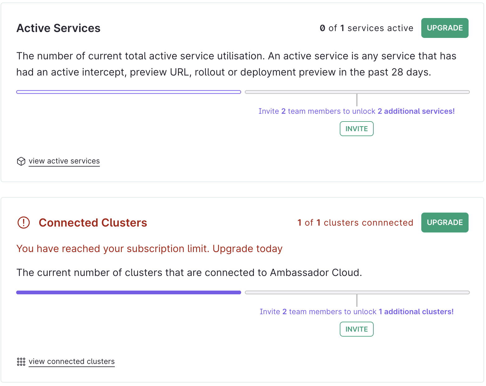
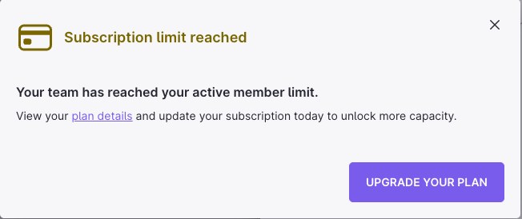
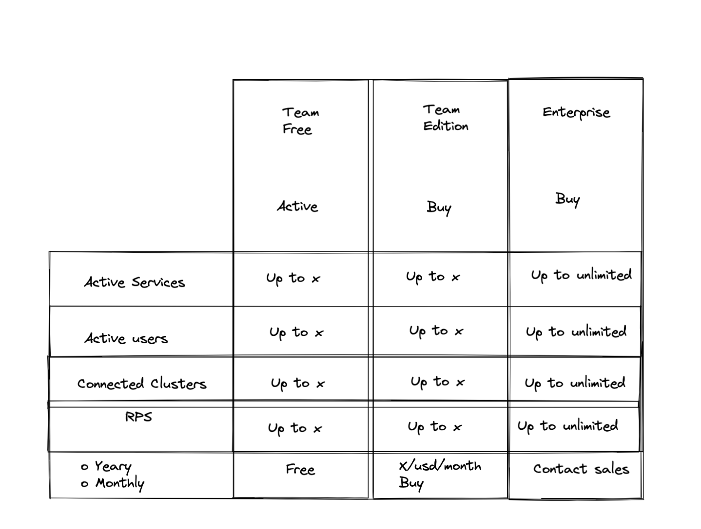
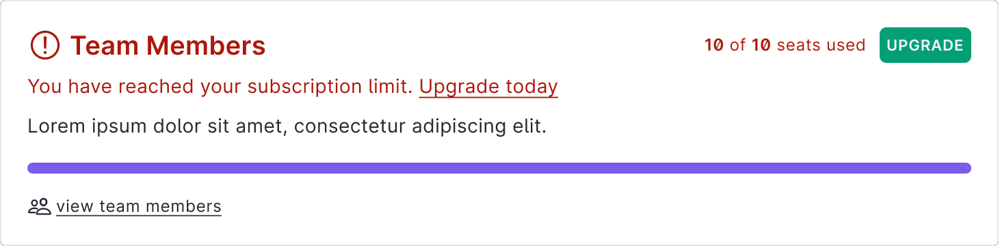

# Manage my subscriptions

Ambassador Labs provides a variety of different subscription options depending on your needs. Whether you're working with a small team with a few developers or a company with a large number of services, Ambassador Labs has flexible subscription options for you to chose from. 

## Check or upgrade your subscription

In user settings, go to the **Subscriptions** section.

The Subscription section of the Settings page shows your current utilization of Ambassador Cloud and the limits of your plan. Teams Edition subscribers can see their payment history here as well. If you’re nearing any of the quota limits, you can upgrade your subscription tier on this page. To learn more about the upgrade process, see the [upgrade your plan section](#upgrade-your-plan) below.

  

    
  

## Quota types

### Team Members

Ambassador Cloud users who have accepted an invitation sent by you through the Members page in your account settings.

### Active Services

Active services are those which have had an action performed on them within the last 28 days. Actions include intercepts, rollouts, and mappings.

### Connected Clusters

The Kubernetes clusters you have connected to the Ambassador Cloud app.

### Requests per Second

(Request per second) RPS is the **maximum usage** in the cluster between Rate Limited Traffic and Authenticated Traffic.
With multiple clusters, RPS is the **sum** of the maximum usage of each cluster.

RPS is calculated from a database snapshot sent by Edge Stack every 30 seconds.

## Extend your quotas by adding more users

On the Free subscription tier, you can unlock additional quotas by adding more team members to your organization. On the subcription page, click the INVITE button and follow the listed steps to invite new team members and gain access to additional clusters and services for free.

 

  

## Quota limits

Once you've reached a quota limit, you need to upgrade your plan to add more clusters, services, or team members. When the quota limit is reached, the following message is displayed:

  

    
  

## Upgrade your plan

If a quota does not fit your requirements, click **upgrade** to increase your quotas.

This opens the following page:

  

    
  

Once you have identified a more suitable subscription plan, click on **Buy Now** to be redirected to the checkout page, or **Contact Sales** to talk to us about the details of the Enterprise plan.

### Example

For example, on the subscription page the team member quota indicates that you have up to 10 seats available. If you reach the limit, you can either release one seat, or **upgrade** your plan to increase the limit.

  

    
  
