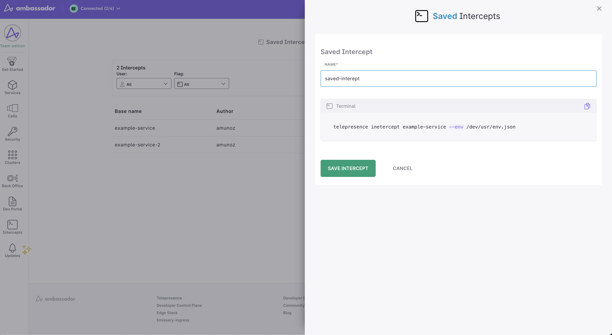
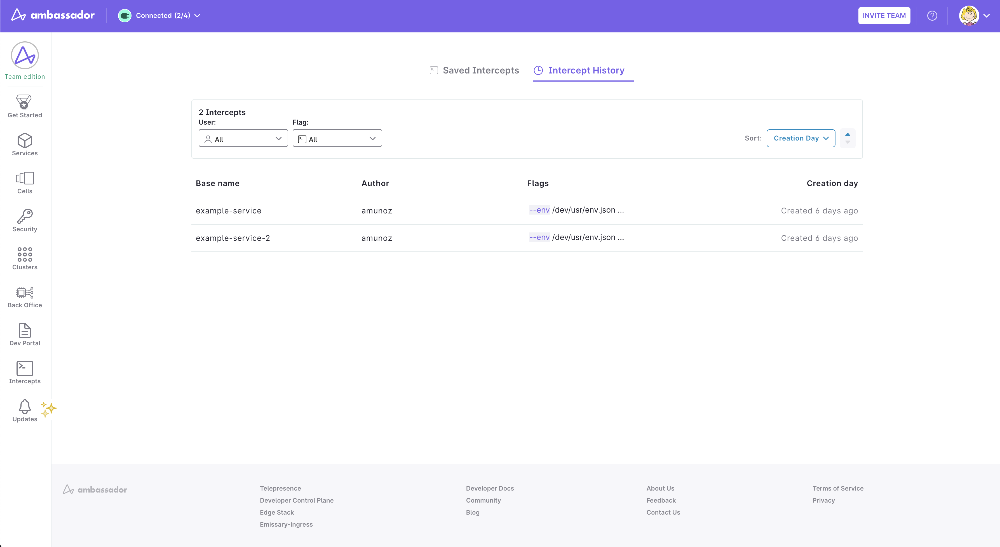

# Telepresence Saved Intercepts

To make it easier to share Telepresence intercept configuration across team members Ambassador Cloud offers the option to create Saved Intercepts
in which you can pick an intercept command from your team's intercept history and give it a name. Later in the CLI you can reference the saved intercept
by the name you chose and run intercepts with the same arguments set, that way you don't have to remember all the configuration parameters used to intercept
a particular service in a given environment.

## Creating a Saved Intercept 

### Prerequisites

1. Telepresence installed locally. [See the installation instructions](../../../telepresence/latest/install/index.md).
1. An account in Ambassador Cloud.
1. Access to a Kubernetes cluster.

### Creating and using a Saved Intercept

Follow the next instructions to create a saved intercept and share it with your team memebers.

1. Run `telepresence login` to authenticate yourself in Ambassador Cloud.
2. Run `telepresence connect`
3. Intercept traffic to a service running in your Kubernetes cluster by creating an intercept. For example:
   ```bash
   telepresence intercept voting --port 8081:8080 --namespace emojivoto --http-header x-telepresence-intercept-id=test-user-1
   ```
   When you execute intercept commands the Telepresence user daemon will create a history of all of them in Ambassador Cloud
   so you can view them and use them as a source of configuration to create Saved Intercepts.
4. Navigate to Ambassador Cloud to the [Intercept History page](https://app.getambassador.io/saved-intercepts/history) and pick the one you just
   executed. Click on the row to see the new Saved Intercept form and give the intercept configuration a name. After saving the intercept will be available
   for all of the team members to use in their Telepresence CLI.


**Note**: Telepresence only creates the intercept history record in version v2.6.9 (to be confirmed) or later.
   

### Using a Saved Intercept

Once a teammate or yourself have created a saved intercept you can reuse it to create more intercepts with the same set of arguments as in the original command just by typing:

```bash
telepresence intercept <saved-intercept-name>
```

The previous command will fetch the intercpet configuration used to create the saved intercept and use it to run a new intercept so you
don't have to remember all the arguments required to intercept a service from a particular cluster.

**Note**: This feature is only available in Telepresence CLI version v2.6.9 (to be confirmed)

Screenshot TBD

##  Managing Saved Intercepts

By navigating to the [Telepresence Saved Intercepts page on Ambassador Cloud](https://app.getambassador.io/saved-intercepts/saved-intercept),
you can see the list of saved intercepts created by any Ambassador team member. For each of these, you can:

-  inspect its author, creation date and flags.
- delete a saved intercept.
- see the whole interept command as it would be translated in the CLI.



