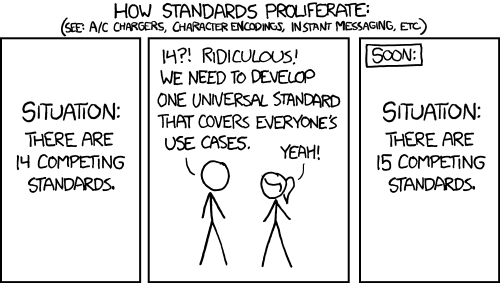

# Explore distributed tracing and Kubernetes monitoring

The Kubernetes monitoring and distributed tracing landscape is hard to grasp. Although this conceptual approach to [observability is nothing new](https://blog.getambassador.io/distributed-tracing-with-java-microdonuts-kubernetes-and-the-ambassador-api-gateway-ace15b62a89e) — companies like New Relic revolutionized single-application performance monitoring (APM) over a decade ago — it took a few years and the [Dapper publication](https://research.google/pubs/pub36356/) for this idea to migrate to distributed applications. The importance of this technology is only increasing, as more and more of us are building deep systems.

As the industry is slowly but surely maturing, standardization is underway. Standardization means proprietary vendor solutions and open source projects are able to collaborate, making our lives easier. For newcomers, understanding the plethora of options, concepts, specifications, and implementations available is still a daunting task:

* How are Zipkin and Jaeger related?
* What is header propagation?
* Which headers format should I use?
* Who owns the initialization of a trace context?
* How are the data points collected?

## Tracing the Future: OpenTelemetry

The [OpenTelemetry project](https://opentelemetry.io/) was created with the intent of stopping the proliferation of API standards and libraries one might need to support for all their observability needs, effectively replacing the Zipkin-API, OpenCensus, OpenTracing and more competing implementations.

> OpenTelemetry provides a single set of APIs, libraries, agents, and collector services to capture distributed traces and metrics from your application. You can analyze them using Prometheus, Jaeger, and other observability tools. 
-[https://opentelemetry.io/](https://opentelemetry.io/)

It’s at this point in the conversation that someone inevitably mentions that XKCD...

OpenTelemetry ultimately supports multiple formats in its [OpenTelemetry-Collector](https://github.com/open-telemetry/opentelemetry-collector), easing the transition from one technology to another when installed as a middleware and translator to relay trace data to other collectors. Along with many of its long-awaited features, it supports multiple trace exporters for Jaeger, Zipkin and proprietary APIs.

## Learn More
We also have guides to setup Edge Stack with [Datadog](../tracing-datadog/), [Zipkin](../tracing-zipkin/), and [Prometheus and Grafana](../prometheus).
