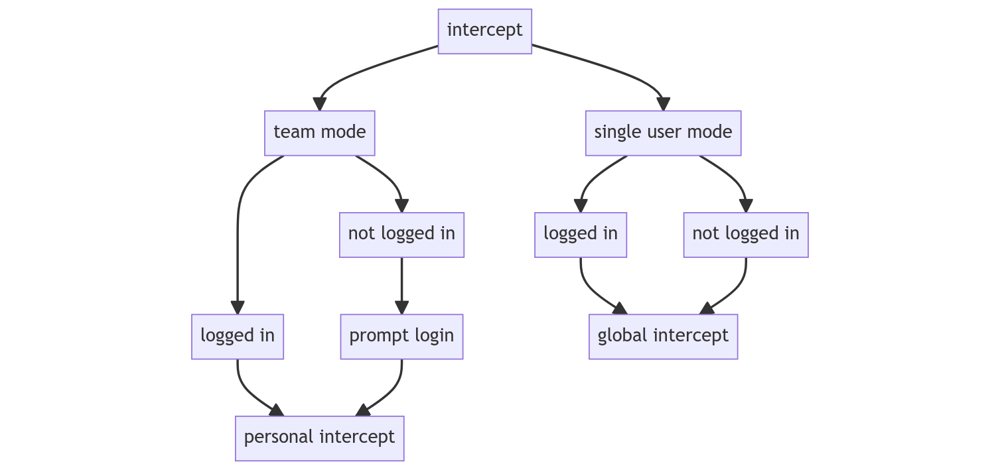

# Modes

A Telepresence installation happens in two locations, initially on  your laptop or workstation, and then on your cluster after running `telepresence helm install`.
The main component that gets installed into the cluster is known as the Traffic Manager.
The Traffic Manager can be put either into single user mode (the default) or into team mode.
Modes give cluster admins the ability to enforce both [intercept type](../intercepts) defaults and logins across all connected users, enabling teams to colaborate and intercept without stepping getting in eachothers way.

## Single user mode

In single user mode, all intercepts will be [global intercepts](../intercepts?intercept=global) by default.
Global intercepts affect all traffic coming into the intercepted workload; this can cause issues for teams working on the same service.
While single user mode is the default, switching back from team mode is done buy runnning:
```
telepresence helm install --single-user-mode
```

## Team mode

In team mode, all intercepts will be [personal intercepts](../intercepts?intercept=personal) by default and all intercepting users must be logged in.
Personal intercepts selectively affect http traffic coming into the intercepted workload.
Being in team mode adds an additional layer of confidence for developers working on the same service, knowing their teammates wont interrupt their intercepts by mistake.
Since logins are enforced in this mode as well, you can ensure that Ambassador Cloud features, such as intercept history and saved intercepts, are being taken advantage of by everybody on your team.
To switch from single user mode to team mode, run:
```
telepresence helm install --team-mode
```

## Default intercept types based on modes
The mode of the Traffic Manager determines the default type of intercept, [personal](../intercepts?intercept=personal) vs [global](../intercepts?intercept=global).
When in team mode, intercepts default to [personal intercepts](../intercepts?intercept=personal), and logins are enforced for non logged in users.
When in single user mode, all intercepts default to [global intercepts](../intercepts?intercept=global), regardless of login status.
