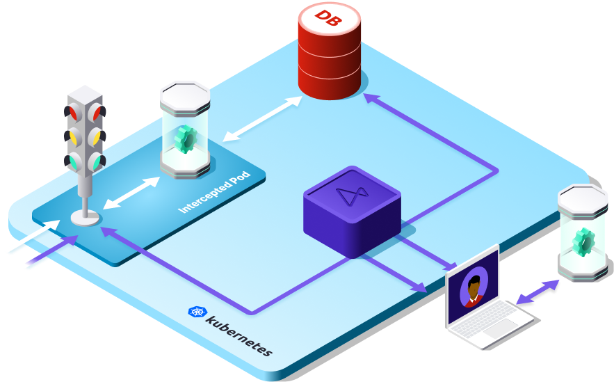
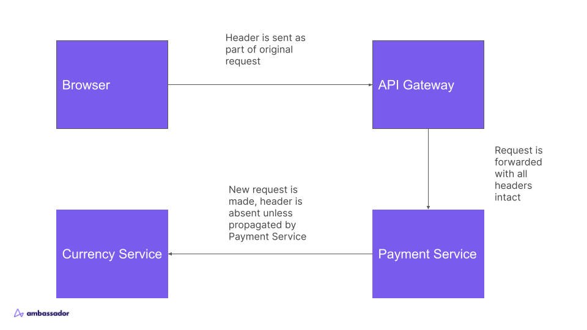

import Alert from '@material-ui/lab/Alert';

# Share development environments with personal intercepts

When you run `telepresence intercept` Telepresence creates a global intercept by default, and redirects all traffic to a cluster service to your laptop.
This can work for some teams, but a major limitation is if two developers need to work on the same application concurrently,
or if adding latency or potential bugs to the integration environment is unacceptable.

  

## Personal intercepts

For these cases, Telepresence has a feature in the Developer and Enterprise plans called the Personal Intercept.
When using a Personal Intercept, Telepresence can selectively route requests to a developer's computer based on an HTTP header value.
By default, Telepresence looks for the header x-telepresence-id, and a logged in Telepresence user is assigned a unique value for that
header on any intercept they create. You can also specify your own custom header. You get your test requests, your coworker gets their test requests,
and the rest of the traffic to the application goes to the original pod in the cluster.

  

## Requirements

Because Personal Intercepts rely on an HTTP header value, that header must be present in any request
I want to intercept. This is very easy in the first service behind an API gateway, as the header can
be added using Telepresence's [Preview URL feature](../preview-urls),
browser plugins or in tools like Postman, and the entire request, with headers intact,
will be forwarded to the first upstream service.

  

However, the original request terminates at the first service that receives it. For the intercept header
to reach any services further upstream, the first service must _propagate_ it, by retrieving the header value
from the request and storing it somewhere or passing it down the function call chain to be retrieved
by any functions that make a network call to the upstream service.

  

## Solutions

If the application you develop is directly the first service to receive incoming requests, you can use [Preview URLs](../preview-urls)
to generate a custom URL that automatically passes an `x-telepresence-id` header that your intercept is configured to look for.

If your applications already propagate a header that can be used to differentiate requests between developers, you can pass the
`--http-header` [flag](../../concepts/intercepts?intercept=personal#creating-and-using-personal-intercepts) to `telepresence intercept`.

If your applications do _not_ already propagate a header that can be used to differentiate requests, we have a
[comprehensive guide](https://github.com/ambassadorlabs/telepresence-header-propagation)
on doing so quickly and easily using OpenTelemetry auto-instrumentation.
