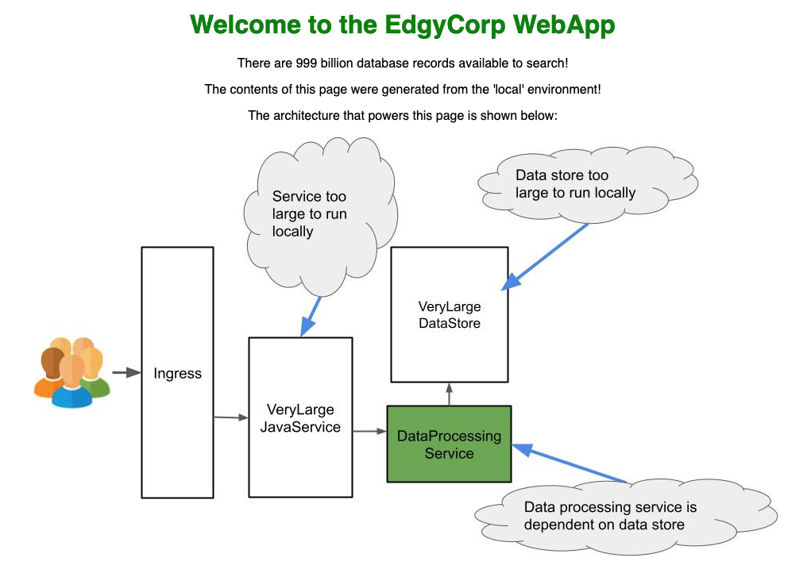

import Alert from '@material-ui/lab/Alert';
import Platform from '@src/components/Platform';
import QSCards26 from './qs-cards'

# Telepresence Quick Start

<div class="docs-article-toc">

  <h3>Contents</h3>

  * [Overview](#overview)
  * [Prerequisites](#prerequisites)
  * [1. Install the Telepresence CLI](#1-install-the-telepresence-cli)
  * [2. Set up a local cluster with sample app](#2-set-up-a-local-cluster-with-sample-app)
  * [3. Use Telepresence to connect your laptop to the cluster](#3-use-telepresence-to-connect-your-laptop-to-the-cluster)
  * [4. Run the sample application locally](#4-run-the-sample-application-locally)
  * [5. Route traffic from the cluster to your local application](#5-route-traffic-from-the-cluster-to-your-local-application)
  * [6. Make a code change (and see it reflected live?)](#6-make-a-code-change)
  * [What's next?](#img-classos-logo-srcimageslogopng-whats-next)

</div>

## Overview
This quickstart provides the fastest way to get an understanding of how [Telepresence](https://www.getambassador.io/products/telepresence)
can speed up your development in Kubernetes. It should take you about 5-10 minutes. You'll create a local cluster using Kind with a sample app installed, and use Telepresence to
* access services in the cluster directly from your laptop
* make changes locally and see those changes immediately in the cluster

Then we'll point you to some next steps you can take, including trying out collaboration features and trying it in your own infrastructure.

## Prerequisites

You’ll need [`kubectl`](https://kubernetes.io/docs/tasks/tools/install-kubectl/) installed and set up
([Linux](https://kubernetes.io/docs/tasks/tools/install-kubectl-linux/#verify-kubectl-configuration) /
[macOS](https://kubernetes.io/docs/tasks/tools/install-kubectl-macos/#verify-kubectl-configuration) /
[Windows](https://kubernetes.io/docs/tasks/tools/install-kubectl-windows/#verify-kubectl-configuration))
to use a Kubernetes cluster.

You will also need [Docker installed](https://docs.docker.com/get-docker/).

The sample application instructions default to Python, which is pre-installed on MacOS and Linux. If you are on Windows and don't already have
Python installed, you can install it from the [official Python site](https://www.python.org/downloads/).

There are also instructions for NodeJS, Java and Go if you already have those installed and prefer to work in them.

## 1. Install the Telepresence CLI

<Platform.TabGroup>
<Platform.MacOSTab>

```shell
# Intel Macs

# Install via brew:
brew install datawire/blackbird/telepresence

# OR install manually:
# 1. Download the latest binary (~60 MB):
sudo curl -fL https://app.getambassador.io/download/tel2/darwin/amd64/$dlVersion$/telepresence -o /usr/local/bin/telepresence

# 2. Make the binary executable:
sudo chmod a+x /usr/local/bin/telepresence

# Apple silicon Macs

# Install via brew:
brew install datawire/blackbird/telepresence-arm64

# OR Install manually:
# 1. Download the latest binary (~60 MB):
sudo curl -fL https://app.getambassador.io/download/tel2/darwin/arm64/$dlVersion$/telepresence -o /usr/local/bin/telepresence

# 2. Make the binary executable:
sudo chmod a+x /usr/local/bin/telepresence
```

</Platform.MacOSTab>
<Platform.GNULinuxTab>

```shell
# 1. Download the latest binary (~50 MB):
sudo curl -fL https://app.getambassador.io/download/tel2/linux/amd64/$dlVersion$/telepresence -o /usr/local/bin/telepresence

# 2. Make the binary executable:
sudo chmod a+x /usr/local/bin/telepresence
```

</Platform.GNULinuxTab>
<Platform.WindowsTab>

We offer an easy installation path using an [MSI Installer](https://app.getambassador.io/download/tel2/windows/amd64/$dlVersion$/telepresence-setup.exe). However if you'd like to setup Telepresence using Powershell, you can run these commands:

```powershell
# To install Telepresence, run the following commands
# from PowerShell as Administrator.

# 1. Download the latest windows zip containing telepresence.exe and its dependencies (~50 MB):
Invoke-WebRequest https://app.getambassador.io/download/tel2/windows/amd64/$dlVersion$/telepresence.zip -OutFile telepresence.zip

# 2. Unzip the telepresence.zip file to the desired directory, then remove the zip file:
Expand-Archive -Path telepresence.zip -DestinationPath telepresenceInstaller/telepresence
Remove-Item 'telepresence.zip'
cd telepresenceInstaller/telepresence

# 3. Run the install-telepresence.ps1 to install telepresence's dependencies. It will install telepresence to
# C:\telepresence by default, but you can specify a custom path by passing in -Path C:\my\custom\path
powershell.exe -ExecutionPolicy bypass -c " . '.\install-telepresence.ps1';"

# 4. Remove the unzipped directory:
cd ../..
Remove-Item telepresenceInstaller -Recurse -Confirm:$false -Force

# 5. Telepresence is now installed and you can use telepresence commands in PowerShell.
```

</Platform.WindowsTab>
</Platform.TabGroup>

## 2. Set up a local cluster with sample app

We provide [a repo](https://github.com/ambassadorlabs/telepresence-local-quickstart) that sets up a local cluster for you
with the in-cluster Telepresence components and a sample app already installed. It does not need `sudo` or `Run as Administrator` privileges.

<Platform.TabGroup>
<Platform.MacOSTab>

```shell
# Clone the repo with submodules
git clone https://github.com/ambassadorlabs/telepresence-local-quickstart.git --recurse-submodules

# Change to the repo directory
cd telepresence-local-quickstart

# Run the macOS setup script
./macos-setup.sh
```

</Platform.MacOSTab>
<Platform.GNULinuxTab>

```shell
# Clone the repo with submodules
git clone https://github.com/ambassadorlabs/telepresence-local-quickstart.git --recurse-submodules

# Change to the repo directory
cd telepresence-local-quickstart

# Run the Linux setup script
./linux-setup.sh
```

</Platform.GNULinuxTab>
<Platform.WindowsTab>

```powershell
# Clone the repo with submodules
git clone https://github.com/ambassadorlabs/telepresence-local-quickstart.git --recurse-submodules

# Change to the repo directory
cd .\telepresence-local-quickstart\

# Run the Windows setup script
.\windows-setup.ps1
```

</Platform.WindowsTab>
</Platform.TabGroup>

## 3. Use Telepresence to connect your laptop to the cluster

Telepresence connects your local workstation to a remote Kubernetes cluster, allowing you to talk to cluster resources like your laptop
is in the cluster.

<Alert severity="info">
  The first time you run a Telepresence command you will be prompted to create an <a href="https://getambassador.io">Ambassador Labs</a> account. Creating an account is completely free,
  takes a few seconds and can be done through accounts you already have, like GitHub and Google.
</Alert>

1. Connect to the cluster:
  `telepresence connect`

  ```
  $ telepresence connect

  Launching Telepresence Daemon
  ...
  Connected to context default (https://<cluster-public-IP>)
  ```

  <Alert severity="info">
    macOS users: If you receive an error when running Telepresence that the developer cannot be verified, open
    <br />
    <strong>System Preferences → Security & Privacy → General</strong>.
    <br />
    Click <strong>Open Anyway</strong> at the bottom to bypass the security block. Then retry the <code>telepresence connect</code> command.
  </Alert>

2. Now we'll test that Telepresence is working properly by accessing a service running in the cluster. Telepresence has merged your local IP routing
tables and DNS resolution with the clusters, so you can talk to the cluster in its DNS language and to services on their cluster IP address.

Open up a browser and go to [http://verylargejavaservice.default:8080](http://verylargejavaservice.default:8080). As you can see you've loaded up a dashboard showing the architecture of the sample app.
<p align="center">
  
</p>

You are connected to the VeryLargeJavaService, which talks to the DataProcessingService as an upstream dependency. The DataProcessingService in turn
has a dependency on VeryLargeDatastore. You were able to connect to it using the cluster DNS name thanks to Telepresence.

## 4. Run the sample application locally

We'll take on the role of a DataProcessingService developer. We want to be able to connect to that big test database that everyone has that dates back to the
founding of the company and has all the critical test scenarios and is too big to run locally. In the other direction, VeryLargeJavaService is developed by another team
and we need to make sure with each change that we are being good upstream citizens and maintaining valid contracts with that service.

<Alert severity="info">
Confirm first that nothing is running locally on port 3000! If <code>curl localhost:3000</code> returns <code>Connection refused</code> then you should be good to go.
</Alert>

<Platform.TabGroup>
<Platform.PythonTab>
To run the DataProcessingService locally:

1. Change into the repo directory, then into DataProcessingService: `cd edgey-corp-python/DataProcessingService/`
2. Install the dependencies and start the Python server: `pip install flask requests && python app.py`
3. In a **new terminal window**, curl the service running locally to confirm it’s set to <strong style="color:blue">blue</strong>: `curl localhost:3000/color`

```
$ pip install flask requests && python app.py

Collecting flask
...
Welcome to the DataServiceProcessingPythonService!
...


$ curl localhost:3000/color

"blue"
```
</Platform.PythonTab>
<Platform.NodeTab>
To run the DataProcessingService locally:

1. Change into the repo directory, then into DataProcessingService: `cd edgey-corp-nodejs/DataProcessingService/`
2. Install the dependencies and start the NodeJS server: `npm install && npm start`
3. In a **new terminal window**, curl the service running locally to confirm it’s set to <strong style="color:blue">blue</strong>: `curl localhost:3000/color`

```
$ npm install && npm start

added 170 packages, and audited 171 packages in 597ms
...
Welcome to the DataServiceProcessingNodeService!
...


$ curl localhost:3000/color

"blue"
```
</Platform.NodeTab>
<Platform.JavaTab>
To run the DataProcessingService locally:

1. Change into the repo directory, then into DataProcessingService: `cd edgey-corp-java/DataProcessingService/`
2. Install the dependencies and start the Java server: `mvn spring-boot:run`
3. In a **new terminal window**, curl the service running locally to confirm it’s set to <strong style="color:blue">blue</strong>: `curl localhost:3000/color`

```
$ mvn spring-boot:run

[INFO] Scanning for projects...
...
INFO 49318 --- [  restartedMain] g.d.DataProcessingServiceJavaApplication : Starting DataProcessingServiceJavaApplication using Java
...


$ curl localhost:3000/color

"blue"
```
</Platform.JavaTab>
<Platform.GolangTab>
To run the DataProcessingService locally:

1. Change into the repo directory, then into DataProcessingService: `cd edgey-corp-go/DataProcessingService/`
2. Install the dependencies and start the Go server: `go get github.com/pilu/fresh && go install github.com/pilu/fresh && fresh`
3. In a **new terminal window**, curl the service running locally to confirm it’s set to <strong style="color:blue">blue</strong>: `curl localhost:3000/color`

```
$ go get github.com/pilu/fresh && go install github.com/pilu/fresh && fresh

12:24:13 runner      | InitFolders
...
12:24:14 app         | Welcome to the DataProcessingGoService!
...


$ curl localhost:3000/color

"blue"
```
</Platform.GolangTab>
</Platform.TabGroup>

<Alert severity="success">
<strong>Victory</strong>, your local server is running a-ok!
</Alert>

## 5. Route traffic from the cluster to your local application
Historically, developing with microservices on Kubernetes your choices have been to run an entire set of services in a cluster or namespace just for you,
and spend 15 minutes on every one line change pushing the code, waiting for it to build, waiting for it to deploy, etc. Or, you could run all 50 services
in your environment on your laptop, and be deafened by the fans.

With Telepresence, you can *intercept* traffic from a service in the cluster and route it to our laptop, effectively replacing the cluster version
with your local development environment. This gives you back the fast feedback loop of local development, and access to your preferred tools like your favorite IDE or debugger.
And you still have access to all the cluster resources via `telepresence connect`. Now you'll see this in action.

Look back at your browser tab looking at the app dashboard. You see the EdgyCorp WebApp with a <strong style="color:green">green</strong> title and <strong style="color:green">green</strong> pod in the diagram.
The local version of the code has the UI color set to <strong style="color:blue">blue</strong> instead of <strong style="color:green">green</strong>.

Next, we’ll create an intercept. An intercept is a rule that tells Telepresence where to send traffic. In this example, we will send all traffic destined for the DataProcessingService to the version of the DataProcessingService running locally instead:

1. Start the intercept with the `intercept` command, setting the service name and port:
`telepresence intercept dataprocessingservice --port 3000`

  ```
  $ telepresence intercept dataprocessingservice --port 3000

  Using Deployment dataprocessingservice
    Intercept name    : dataprocessingservice
    State             : ACTIVE
    Workload kind     : Deployment
    Destination       : 127.0.0.1:3000
    Intercepting      : all TCP requests
  ```

2. Go to the frontend service again in your browser and refresh. You will now see the <strong style="color:blue">blue</strong> elements in the app.

<Alert severity="success">
The frontend’s request to DataProcessingService is being <strong>intercepted and rerouted</strong> to the Python server on your laptop!
</Alert>

## 6. Make a code change
We’ve now set up a local development environment for the DataProcessingService, and we’ve created an intercept that sends traffic in the cluster to our local environment. We can now combine these two concepts to show how we can quickly make and test changes.

<Platform.TabGroup>
<Platform.PythonTab>
To update the color:

1. Open `edgey-corp-python/DataProcessingService/app.py` in your editor and change `DEFAULT_COLOR` on line 15 from `blue` to `orange`. Save the file and the python server will auto reload.
2. Now, visit [http://verylargejavaservice:8080](http://verylargejavaservice:8080) again in your browser and refresh. You will now see the orange elements in the application.

<Alert severity="success">
  We’ve just shown how we can edit code locally, and <strong>immediately</strong> see these changes in the cluster.
  <br />
  Normally, this process would require a container build, push to registry, and deploy.
  <br />
  With Telepresence, these changes happen instantly.
</Alert>
</Platform.PythonTab>
<Platform.NodeTab>
To update the color:

1. Open `edgey-corp-nodejs/DataProcessingService/app.js` in your editor and change line 6 from `blue` to `orange`. Save the file and the Node server will auto reload.
2. Now, visit [http://verylargejavaservice:8080](http://verylargejavaservice:8080) again in your browser. You will now see the <strong style="color:orange">orange</strong> elements in the application.

<Alert severity="success">
  We’ve just shown how we can edit code locally, and <strong>immediately</strong> see these changes in the cluster.
  <br />
  Normally, this process would require a container build, push to registry, and deploy.
  <br />
  With Telepresence, these changes happen instantly.
</Alert>
</Platform.NodeTab>
<Platform.JavaTab>
To update the color:

1. Open `edgey-corp-java/DataProcessingService/src/main/resources/application.properties` in your editor and change `app.default.color` on line 2 from `blue` to `orange`. Save the file then stop and restart your Java server.
2. Now, visit [http://verylargejavaservice:8080](http://verylargejavaservice:8080) again in your browser. You will now see the orange elements in the application.

<Alert severity="success">
  We’ve just shown how we can edit code locally, and <strong>immediately</strong> see these changes in the cluster.
  <br />
  Normally, this process would require a container build, push to registry, and deploy.
  <br />
  With Telepresence, these changes happen instantly.
</Alert>
</Platform.JavaTab>
<Platform.GolangTab>
To update the color:

1. Open `edgey-corp-go/DataProcessingService/main.go` in your editor and change `var color string` from `blue` to `orange`. Save the file and the Go server will auto reload.
2. Now, visit [http://verylargejavaservice:8080](http://verylargejavaservice:8080) again in your browser. You will now see the orange elements in the application.

<Alert severity="success">
  We’ve just shown how we can edit code locally, and <strong>immediately</strong> see these changes in the cluster.
  <br />
  Normally, this process would require a container build, push to registry, and deploy.
  <br />
  With Telepresence, these changes happen instantly.
</Alert>
</Platform.GolangTab>
</Platform.TabGroup>

##  What's Next?

<QSCards26/>

export const metaData = [
    {name: "Ambassador Labs", path: "https://getambassador.io"},
    {name: "Telepresence", path: "https://www.getambassador.io/products/telepresence"},
    {name: "Install Tools | Kubernetes", path: "https://kubernetes.io/docs/tasks/tools/install-kubectl/"},
    {name: "Get Docker", path: "https://docs.docker.com/get-docker/"},
    {name: "Download Python | Python.org", path: "https://www.python.org/downloads/"},
    {name: "Telepresence Local Quickstart", path: "https://github.com/ambassadorlabs/telepresence-local-quickstart"}
]
