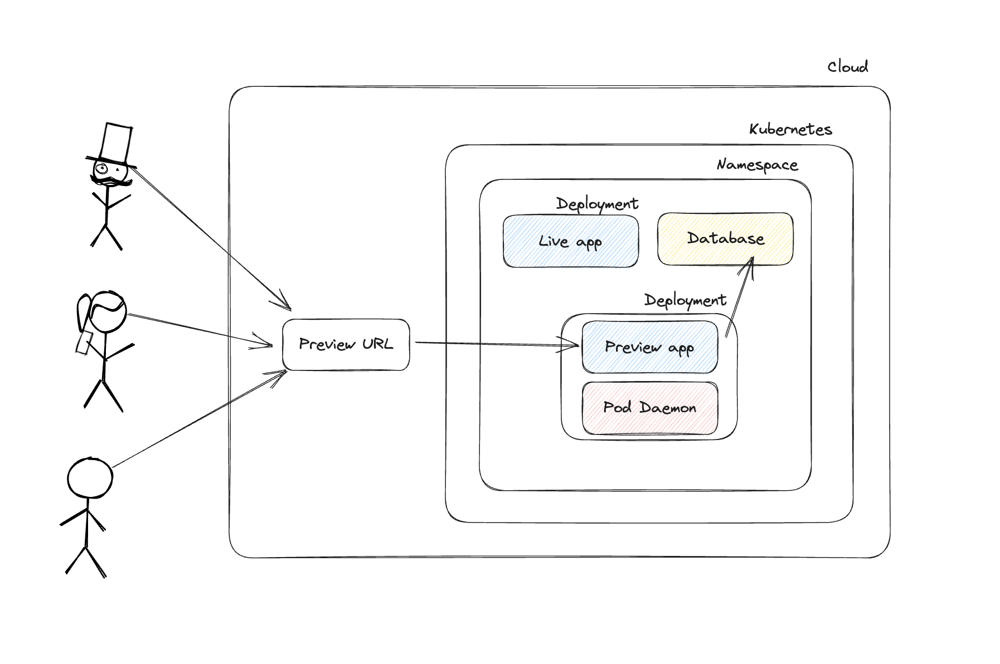

# Telepresence with Pod Daemon


The Pod Daemon facilitates the execution of Telepresence by using a Pod as a sidecar to your application. This becomes particularly beneficial when intending to incorporate Deployment Previews into your pipeline. Essentially, the pod-daemon is a Telepresence instance running in a pod, rather than operating on a developer's laptop.

This presents a compelling solution for developers who wish to share a live iteration of their work within the organization. A preview URL can be produced, which links directly to the image created during the Continuous Integration (CI) process. This Preview URL can then be appended to the pull request, streamlining the code review process and enabling real-time project sharing within the team.

## Overview

The Pod Daemon functions as an optimized version of Telepresence, undertaking all preliminary configuration tasks (such as login and daemon startup), and additionally executing the intercept.

The initial setup phase involves deploying a service account with the necessary minimal permissions for running Telepresence, coupled with a secret that holds the API KEY essential for executing a Telepresence login.

Following this setup, your main responsibility consists of deploying your operational application, which incorporates a pod daemon operating as a sidecar. The parameters for the pod daemon require the relevant details concerning your live application. As it initiates, the pod daemon will intercept your live application and divert traffic towards your working application. This traffic redirection is based on your configured headers, which come into play each time the application is accessed.

   <p align="center">
    
   </p>

## Usage

To commence the setup, it's necessary to deploy both a service account and a secret. Here's how to go about it:

1. Establish a connection to your cluster and proceed to deploy this within the namespace of your live application (default in this case).

  ```yaml
  ---
  apiVersion: v1
  kind: ServiceAccount
  metadata:
    name: ambassador-deploy-previews
    namespace: default
    labels:
      app.kubernetes.io/name: ambassador-deploy-previews
  ---
  apiVersion: v1
  kind: ServiceAccount
  metadata:
    name: ambassador-deploy-previews
    namespace: default
    labels:
      app.kubernetes.io/name: ambassador-deploy-previews
  ---
  apiVersion: rbac.authorization.k8s.io/v1
  kind: ClusterRoleBinding
  metadata:
    name: ambassador-deploy-previews
    labels:
      app.kubernetes.io/name: ambassador-deploy-previews
  roleRef:
    apiGroup: rbac.authorization.k8s.io
    kind: ClusterRole
    name: ambassador-deploy-previews
  subjects:
    - name: ambassador-deploy-previews
      namespace: default
      kind: ServiceAccount
  ---
  apiVersion: rbac.authorization.k8s.io/v1
  kind: ClusterRole
  metadata:
    labels:
      rbac.getambassador.io/role-group: ambassador-deploy-previews
    name: ambassador-deploy-previews
  rules:
    - apiGroups: [ "" ]
      verbs: [ "get", "list", "watch", "create", "delete" ]
      resources:
        - namespaces
        - pods
        - pods/log
        - pods/portforward
        - services
        - secrets
        - configmaps
        - endpoints
        - nodes
        - deployments
        - serviceaccounts

    - apiGroups: [ "apps", "rbac.authorization.k8s.io", "admissionregistration.k8s.io" ]
      verbs: [ "get", "list", "create", "update", "watch" ]
      resources:
        - deployments
        - statefulsets
        - clusterrolebindings
        - rolebindings
        - clusterroles
        - replicasets
        - roles
        - serviceaccounts
        - mutatingwebhookconfigurations

    - apiGroups: [ "getambassador.io" ]
      verbs: [ "get", "list", "watch" ]
      resources: [ "*" ]

    - apiGroups: [ "getambassador.io" ]
      verbs: [ "update" ]
      resources: [ "mappings/status" ]

    - apiGroups: [ "networking.x-k8s.io" ]
      verbs: [ "get", "list", "watch" ]
      resources: [ "*" ]

    - apiGroups: [ "networking.internal.knative.dev" ]
      verbs: [ "get", "list", "watch" ]
      resources: [ "ingresses", "clusteringresses" ]

    - apiGroups: [ "networking.internal.knative.dev" ]
      verbs: [ "update" ]
      resources: [ "ingresses/status", "clusteringresses/status" ]

    - apiGroups: [ "extensions", "networking.k8s.io" ]
      verbs: [ "get", "list", "watch" ]
      resources: [ "ingresses", "ingressclasses" ]

    - apiGroups: [ "extensions", "networking.k8s.io" ]
      verbs: [ "update" ]
      resources: [ "ingresses/status" ]
  ---
  apiVersion: v1
  kind: Secret
  metadata:
    name: deployment-preview-apikey
    namespace: default
  type: Opaque
  stringData:
    AMBASSADOR_CLOUD_APIKEY: "{YOUR_API_KEY}"

  ```

2. Following this, you will need to deploy the iteration image together with the pod daemon, serving as a sidecar. In order to utilize the pod-daemon command, the environmental variable `IS_POD_DAEMON` must be set to `True`. This setting is a prerequisite for activating the pod-daemon functionality.

  ```yaml
  ---
  apiVersion: apps/v1
  kind: Deployment
  metadata:
    name: quote-ci
  spec:
    selector:
      matchLabels:
        run: quote-ci
    replicas: 1
    template:
      metadata:
        labels:
          run: quote-ci
      spec:
        serviceAccountName: ambassador-deploy-previews
        containers:
        # Include your application container
        # - name: your-original-application
        #   image: image-built-from-pull-request
        #   [...]
        # Inject the pod-daemon container 
        # In the following example, we'll demonstrate how to integrate the pod-daemon container by intercepting the quote app
        - name: pod-daemon
          image: datawire/ambassador-telepresence:$version$
          ports:
            - name: http
              containerPort: 80
            - name: https
              containerPort: 443
          resources:
            limits:
              cpu: "0.1"
              memory: 100Mi
          args:
            - pod-daemon
            - --workload-name=quote
            - --workload-namespace=default
            - --workload-kind=Deployment
            - --port=8080
            - --http-header=test-telepresence=1 # Custom header can be specified
            - --ingress-tls=false
            - --ingress-port=80
            - --ingress-host=quote.default.svc.cluster.local
            - --ingress-l5host=quote.default.svc.cluster.local
          env:
            - name: AMBASSADOR_CLOUD_APIKEY
              valueFrom:
                secretKeyRef:
                  name: deployment-preview-apikey
                  key: AMBASSADOR_CLOUD_APIKEY
            - name: TELEPRESENCE_MANAGER_NAMESPACE
              value: ambassador
            - name: IS_POD_DAEMON
              value: "True"
  ```

3. The preview URL can be located within the logs of the pod daemon:

  ```bash
  kubectl logs -f quote-ci-6dcc864445-x98wt -c pod-daemon
  ```