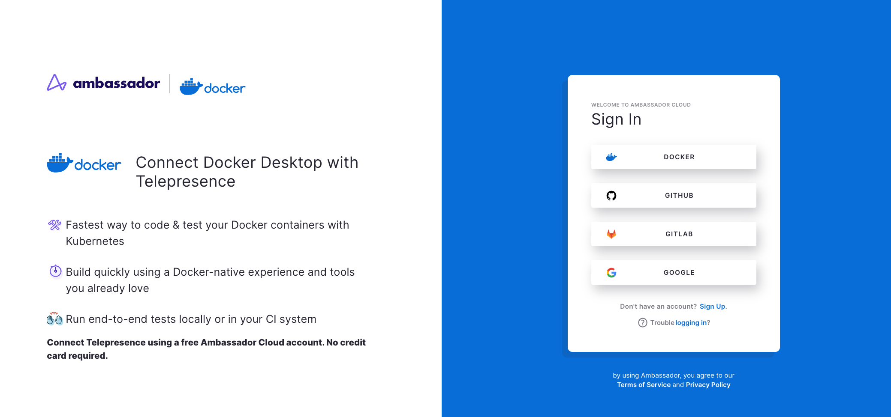
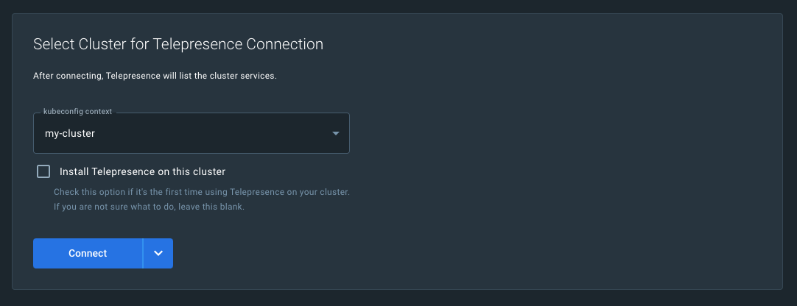
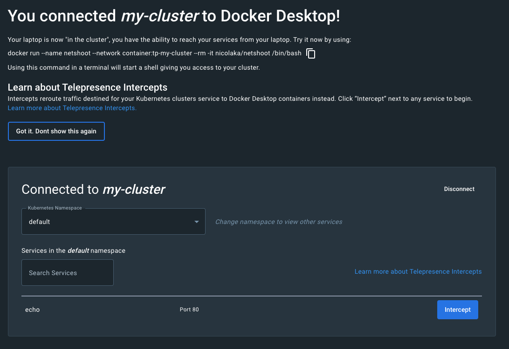
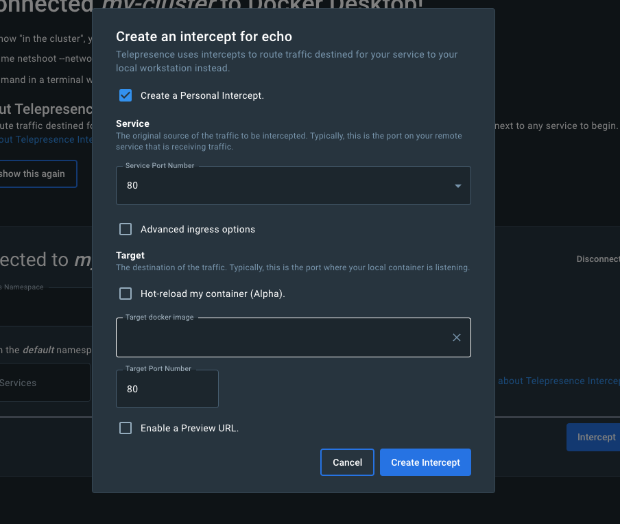
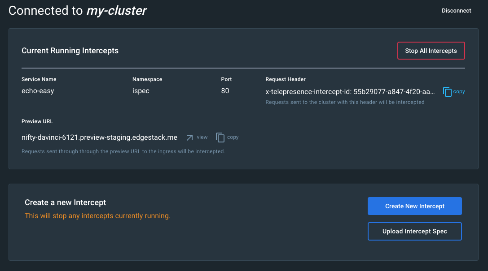
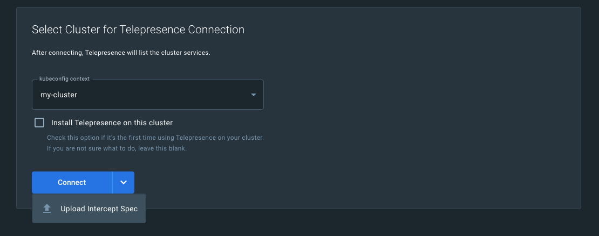

# Telepresence for Docker Extension

The [Telepresence Docker extension](../../../../../kubernetes-learning-center/telepresence-docker-extension/) is an extension that runs in Docker Desktop. This extension allows you to spin up a selection of your application and run the Telepresence daemons in that container. The Telepresence extension allows you to intercept a service and redirect cloud traffic to containers.

## Quick Start

This Quick Start guide will walk you through creating your first intercept in the Telepresence extension in Docker Desktop.

## Connect to Ambassador Cloud through the Telepresence Docker extension.

   1. Click the Telepresence extension in Docker Desktop, then click **Get Started**.

   2. You'll be redirected to Ambassador Cloud for login, you can authenticate with **Docker**, Google, GitHub or GitLab account.
   

    
   

## Create an Intercept from a Kubernetes service

   1. Select the Kubernetes context you would like to connect to.
   

    
   

   2. Once Telepresence is connected to your cluster you will see a list of services you can connect to. If you don't see the service you want to intercept, you may need to change namespaces in the dropdown menu.
   

      
   

   3. Click the **Intercept** button on the service you want to intercept. You will see a popup to help configure your intercept, and intercept handlers.
   

      
   

 
   4. Telepresence will start an intercept on the service and your local container on the designated port. You will then be redirected to a management page where you can view your active intercepts.
   

      
   

## Create an Intercept from an Intercept Specification.

   1. Click the dropdown on the **Connect** button to activate the option to upload an intercept specification. 
   

    
   

   2. Once your specification has been uploaded, the extension will process it and redirect you to the running intercepts page after it has been started. 

   3. The intercept information now shows up in the Docker Telepresence extension. You can now [test your code](#test-your-code).
   

    
   

   <Alert severity="info">
      For more information on Intercept Specifications see the docs <a href="/docs/telepresence/latest/reference/intercepts/specs">here</a>.
   </Alert>

## Test your code

Now you can make your code changes in your preferred IDE. When you're finished, build a new container with your code changes and restart your intercept.

Click `view` next to your preview URL to open a browser tab and see the changes you've made in real time, or you can share the preview URL with teammates so they can review your work.