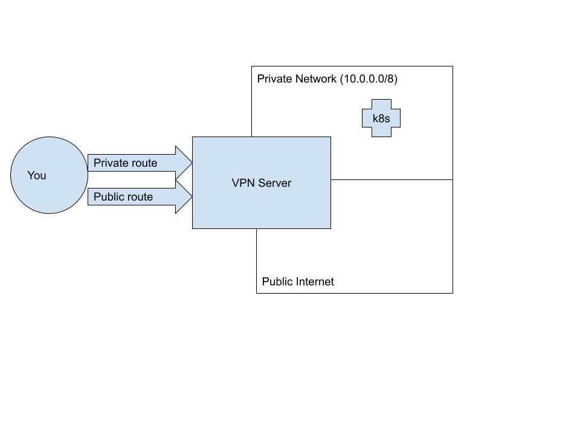
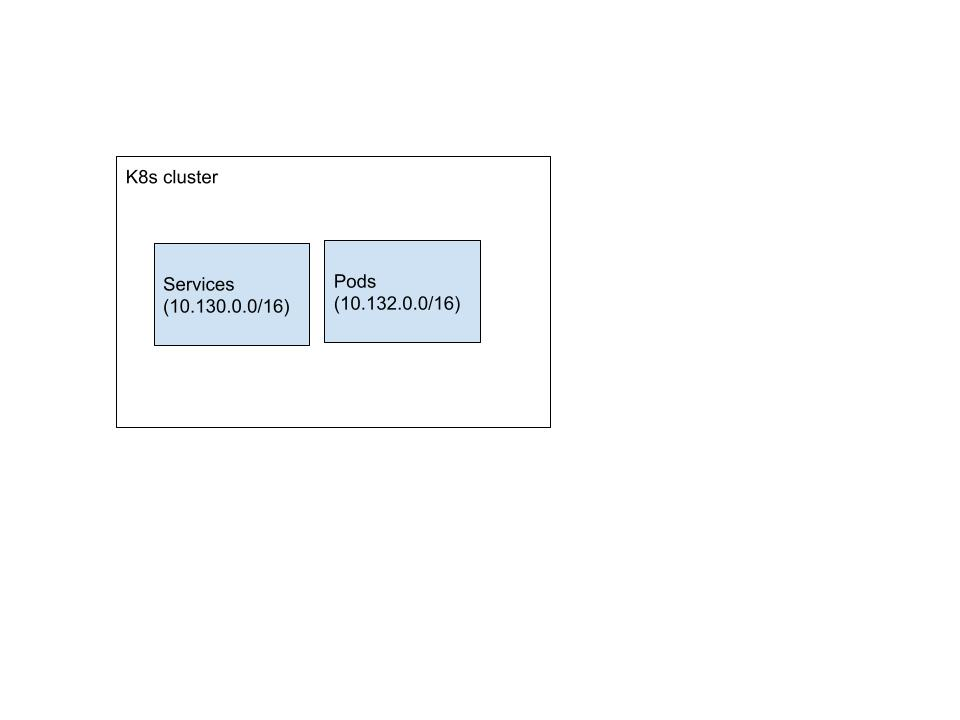
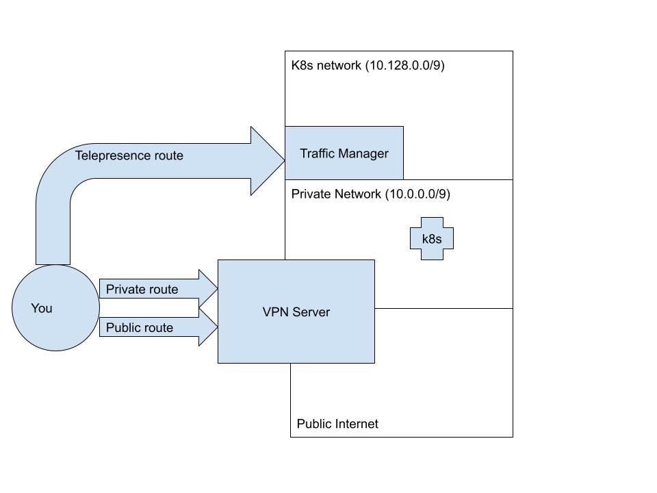

<!-- TODO: We should figure out a way to make this site-wide without affecting the release notes page -->
<div class="container">


# Telepresence and VPNs

It is often important to set up Kubernetes API server endpoints to be only accessible via a VPN.
In setups like these, users need to connect first to their VPN, and then use Telepresence to connect
to their cluster. As Telepresence uses many of the same underlying technologies that VPNs use,
the two can sometimes conflict. This page will help you identify and resolve such VPN conflicts.


<Alert severity="warning">
The <strong>test-vpn</strong> command, which was once part of Telepresence, became obsolete in <strong>2.14</strong> due to a change in functionality and was subsequently removed.
</Alert>


## VPN Configuration

Let's begin by reviewing what a VPN does and imagining a sample configuration that might come
to conflict with Telepresence.
Usually, a VPN client adds two kinds of routes to your machine when you connect.
The first serves to override your default route; in other words, it makes sure that packets
you send out to the public internet go through the private tunnel instead of your
ethernet or wifi adapter. We'll call this a `public VPN route`.
The second kind of route is a `private VPN route`. These are the routes that allow your
machine to access hosts inside the VPN that are not accessible to the public internet.
Generally speaking, this is a more circumscribed route that will connect your machine
only to reachable hosts on the private network, such as your Kubernetes API server.

This diagram represents what happens when you connect to a VPN, supposing that your
private network spans the CIDR range: `10.0.0.0/8`.



## Kubernetes configuration

One of the things a Kubernetes cluster does for you is assign IP addresses to pods and services.
This is one of the key elements of Kubernetes networking, as it allows applications on the cluster
to reach each other. When Telepresence connects you to the cluster, it will try to connect you
to the IP addresses that your cluster assigns to services and pods.
Cluster administrators can configure, on cluster creation, the CIDR ranges that the Kubernetes
cluster will place resources in. Let's imagine your cluster is configured to place services in
`10.130.0.0/16` and pods in `10.132.0.0/16`:



## Telepresence conflicts

When you run `telepresence connect` to connect to a cluster, it talks to the API server
to figure out what pod and service CIDRs it needs to map in your machine. If it detects
that these CIDR ranges are already mapped by a VPN's `private route`, it will produce an
error and inform you of the conflicting subnets:

```console
$ telepresence connect
telepresence connect: error: connector.Connect: failed to connect to root daemon: rpc error: code = Unknown desc = subnet 10.43.0.0/16 overlaps with existing route "10.0.0.0/8 via 10.0.0.0 dev utun4, gw 10.0.0.1"
```

To resolve this, you'll need to carefully consider what your network layout looks like.
Telepresence is refusing to map these conflicting subnets because its mapping them
could render certain hosts that are inside the VPN completely unreachable. However,
you (or your network admin) know better than anyone how hosts are spread out inside your VPN.
Even if the private route routes ALL of `10.0.0.0/8`, it's possible that hosts are only
being spun up in one of the subblocks of the `/8` space. Let's say, for example,
that you happen to know that all your hosts in the VPN are bunched up in the first
half of the space -- `10.0.0.0/9` (and that you know that any new hosts will
only be assigned IP addresses from the `/9` block). In this case you
can configure Telepresence to override the other half of this CIDR block, which is where the
services and pods happen to be.
To do this, all you have to do is configure the `client.routing.allowConflictingSubnets` flag
in the Telepresence helm chart. You can do this directly via `telepresence helm upgrade`:

```console
$ telepresence helm upgrade --set client.routing.allowConflictingSubnets="{10.128.0.0/9}"
```

You can also choose to be more specific about this, and only allow the CIDRs that you KNOW
are in use by the cluster:

```console
$ telepresence helm upgrade --set client.routing.allowConflictingSubnets="{10.130.0.0/16,10.132.0.0/16}"
```

The end result of this (assuming an allow list of `/9`) will be a configuration like this:



</div>
