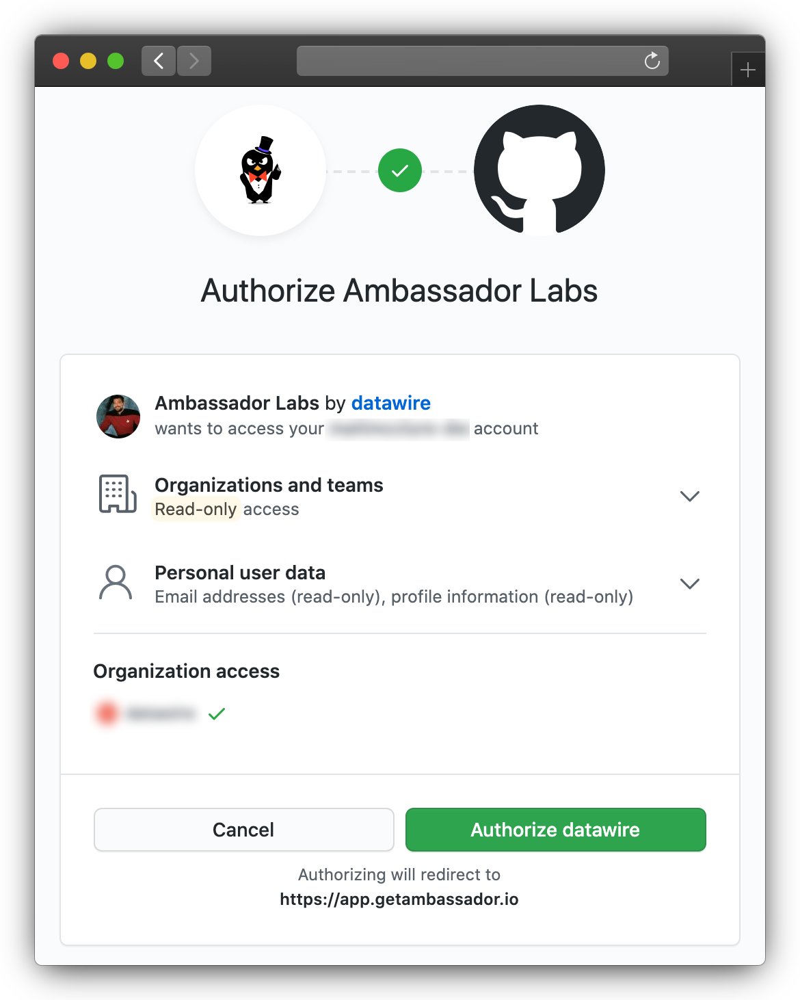
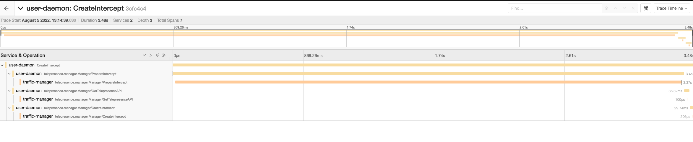

# Troubleshooting

## Creating an intercept did not generate a preview URL

Preview URLs can only be created if Telepresence is [logged in to
Ambassador Cloud](../reference/client/login/).  When not logged in, it
will not even try to create a preview URL (additionally, by default it
will intercept all traffic rather than just a subset of the traffic).
Remove the intercept with `telepresence leave [deployment name]`, run
`telepresence login` to login to Ambassador Cloud, then recreate the
intercept.  See the [intercepts how-to doc](../howtos/intercepts) for
more details.

## Error on accessing preview URL: `First record does not look like a TLS handshake`

The service you are intercepting is likely not using TLS, however when configuring the intercept you indicated that it does use TLS. Remove the intercept with `telepresence leave [deployment name]` and recreate it, setting `TLS` to `n`. Telepresence tries to intelligently determine these settings for you when creating an intercept and offer them as defaults, but odd service configurations might cause it to suggest the wrong settings.

## Error on accessing preview URL: Detected a 301 Redirect Loop

If your ingress is set to redirect HTTP requests to HTTPS and your web app uses HTTPS, but you configure the intercept to not use TLS, you will get this error when opening the preview URL.  Remove the intercept with `telepresence leave [deployment name]` and recreate it, selecting the correct port and setting `TLS` to `y` when prompted.

## Connecting to a cluster via VPN doesn't work.

There are a few different issues that could arise when working with a VPN. Please see the [dedicated page](../reference/vpn) on Telepresence and VPNs to learn more on how to fix these.

## Connecting to a cluster hosted in a VM on the workstation doesn't work

The cluster probably has access to the host's network and gets confused when it is mapped by Telepresence.
Please check the [cluster in hosted vm](../howtos/cluster-in-vm) for more details.

## Your GitHub organization isn't listed

Ambassador Cloud needs access granted to your GitHub organization as a
third-party OAuth app.  If an organization isn't listed during login
then the correct access has not been granted.

The quickest way to resolve this is to go to the **Github menu** →
**Settings** → **Applications** → **Authorized OAuth Apps** →
**Ambassador Labs**.  An organization owner will have a **Grant**
button, anyone not an owner will have **Request** which sends an email
to the owner.  If an access request has been denied in the past the
user will not see the **Request** button, they will have to reach out
to the owner.

Once access is granted, log out of Ambassador Cloud and log back in;
you should see the GitHub organization listed.

The organization owner can go to the **GitHub menu** → **Your
organizations** → **[org name]** → **Settings** → **Third-party
access** to see if Ambassador Labs has access already or authorize a
request for access (only owners will see **Settings** on the
organization page).  Clicking the pencil icon will show the
permissions that were granted.

GitHub's documentation provides more detail about [managing access granted to third-party applications](https://docs.github.com/en/github/authenticating-to-github/connecting-with-third-party-applications) and [approving access to apps](https://docs.github.com/en/github/setting-up-and-managing-organizations-and-teams/approving-oauth-apps-for-your-organization).

### Granting or requesting access on initial login

When using GitHub as your identity provider, the first time you log in
to Ambassador Cloud GitHub will ask to authorize Ambassador Labs to
access your organizations and certain user data.



Any listed organization with a green check has already granted access
to Ambassador Labs (you still need to authorize to allow Ambassador
Labs to read your user data and organization membership).

Any organization with a red "X" requires access to be granted to
Ambassador Labs.  Owners of the organization will see a **Grant**
button.  Anyone who is not an owner will see a **Request** button.
This will send an email to the organization owner requesting approval
to access the organization.  If an access request has been denied in
the past the user will not see the **Request** button, they will have
to reach out to the owner.

Once approval is granted, you will have to log out of Ambassador Cloud
then back in to select the organization.

## Volume mounts are not working on macOS

It's necessary to have `sshfs` installed in order for volume mounts to work correctly during intercepts. Lately there's been some issues using `brew install sshfs` a macOS workstation because the required component `osxfuse` (now named `macfuse`) isn't open source and hence, no longer supported. As a workaround, you can now use `gromgit/fuse/sshfs-mac` instead. Follow these steps:

1. Remove old sshfs, macfuse, osxfuse using `brew uninstall`
2. `brew install --cask macfuse`
3. `brew install gromgit/fuse/sshfs-mac`
4. `brew link --overwrite sshfs-mac`

Now sshfs -V shows you the correct version, e.g.:
```
$ sshfs -V
SSHFS version 2.10
FUSE library version: 2.9.9
fuse: no mount point
```

5. Next, try a mount (or an intercept that performs a mount). It will fail because you need to give permission to “Benjamin Fleischer” to execute a kernel extension (a pop-up appears that takes you to the system preferences).
6. Approve the needed permission
7. Reboot your computer.

## Daemon service did not start

An attempt to do `telepresence connect` results in the error message `daemon service did not start: timeout while waiting for daemon to start` and
the logs show no helpful error.

The likely cause of this is that the user lack permission to run `sudo --preserve-env`. Here is a workaround for this problem. Edit the
sudoers file with:

```command
$ sudo visudo
```

and add the following line:

```
<your username> ALL=(ALL) NOPASSWD: SETENV: /usr/local/bin/telepresence
```

DO NOT fix this by making the Telepresence binary a SUID root. It must only run as root when invoked with `--daemon-foreground`.


## Authorization for preview URLs
Services that require authentication may not function correctly with preview URLs. When accessing a preview URL, it is necessary to configure your intercept to use custom authentication headers for the preview URL. If you don't, you may receive an unauthorized response or be redirected to the login page for Ambassador Cloud.

You can accomplish this by using a browser extension such as the `ModHeader extension` for [Chrome](https://chrome.google.com/webstore/detail/modheader/idgpnmonknjnojddfkpgkljpfnnfcklj) 
or [Firefox](https://addons.mozilla.org/en-CA/firefox/addon/modheader-firefox/).

It is important to note that Ambassador Cloud does not support OAuth browser flows when accessing a preview URL, but other auth schemes such as Basic access authentication and session cookies will work.

## Distributed tracing

Telepresence is a complex piece of software with components running locally on your laptop and remotely in a distributed kubernetes environment.
As such, troubleshooting investigations require tools that can give users, cluster admins, and maintainers a broad view of what these distributed components are doing.
In order to facilitate such investigations, telepresence >= 2.7.0 includes distributed tracing functionality via [OpenTelemetry](https://opentelemetry.io/)
Tracing is controlled via a `grpcPort` flag under the `tracing` configuration of your `values.yaml`. It is enabled by default and can be disabled by setting `grpcPort` to `0`, or `tracing` to an empty object:

```yaml
tracing: {}
```

If tracing is configured, the traffic manager and traffic agents will open a GRPC server under the port given, from which telepresence clients will be able to gather trace data.
To collect trace data, ensure you're connected to the cluster, perform whatever operation you'd like to debug and then run `gather-traces` immediately after:

```console
$ telepresence gather-traces
```

This command will gather traces from both the cloud and local components of telepresence and output them into a file called `traces.gz` in your current working directory:

```console
$ file traces.gz
    traces.gz: gzip compressed data, original size modulo 2^32 158255
```

Please do not try to open or uncompress this file, as it contains binary trace data.
Instead, you can use the `upload-traces` command built into telepresence to send it to an [OpenTelemetry collector](https://opentelemetry.io/docs/collector/) for ingestion:

```console
$ telepresence upload-traces traces.gz $OTLP_GRPC_ENDPOINT
```

Once that's been done, the traces will be visible via whatever means your usual collector allows. For example, this is what they look like when loaded into Jaeger's [OTLP API](https://www.jaegertracing.io/docs/1.36/apis/#opentelemetry-protocol-stable):



**Note:** The host and port provided for the `OTLP_GRPC_ENDPOINT` must accept OTLP formatted spans (instead of e.g. Jaeger or Zipkin specific spans) via a GRPC API (instead of the HTTP API that is also available in some collectors)
**Note:** Since traces are not automatically shipped to the backend by telepresence, they are stored in memory. Hence, to avoid running telepresence components out of memory, only the last 10MB of trace data are available for export.

## No Sidecar Injected in GKE private clusters

An attempt to `telepresence intercept` results in a timeout, and upon examination of the pods (`kubectl get pods`) it's discovered that the intercept command did not inject a sidecar into the workload's pods:

```bash
$ kubectl get pod
NAME                         READY   STATUS    RESTARTS   AGE
echo-easy-7f6d54cff8-rz44k   1/1     Running   0          5m5s

$ telepresence intercept echo-easy -p 8080
Error: rpc error: code = DeadlineExceeded desc = request timed out while waiting for agent echo-easy.default to arrive
telepresence: error: rpc error: code = DeadlineExceeded desc = request timed out while waiting for agent echo-easy.default to arrive

See logs for details (1 error found): "/Users/josecortes/Library/Logs/telepresence/connector.log"
If you think you have encountered a bug, please run `telepresence gather-logs` and attach the telepresence_logs.zip to your github issue or create a new one: https://github.com/telepresenceio/telepresence/issues/new?template=Bug_report.md .

$ kubectl get pod
NAME                        READY   STATUS    RESTARTS   AGE
echo-easy-d8dc4cc7c-27567   1/1     Running   0          2m9s

# Notice how 1/1 containers are ready.
```

If this is occurring in a GKE cluster with private networking enabled, it is likely due to firewall rules blocking the
Traffic Manager's webhook injector from the API server.
To fix this, add a firewall rule allowing your cluster's master nodes to access TCP port `8443` in your cluster's pods.
Please refer to the [telepresence install instructions](../install/cloud#gke) or the [GCP docs](https://cloud.google.com/kubernetes-engine/docs/how-to/private-clusters#add_firewall_rules) for information to resolve this.

## Injected init-container doesn't function properly

The init-container is injected to insert `iptables` rules that redirects port numbers from the app container to the
traffic-agent sidecar. This is necessary when the service's `targetPort` is numeric. It requires elevated privileges
(`NET_ADMIN` capabilities), and the inserted rules may get overridden by `iptables` rules inserted by other vendors,
such as Istio or Linkerd.

Injection of the init-container can often be avoided by using a `targetPort` _name_ instead of a number, and  ensure
that  the corresponding container's `containerPort` is also named. This example uses the name "http", but any valid
name will do:
```yaml
apiVersion: v1
kind: Pod
metadata:
  ...
spec:
  ...
  containers:
    - ...
      ports:
      - name: http
        containerPort: 8080
---
apiVersion: v1
kind: Service
metadata:
  ...
spec:
  ...
  ports:
    - port: 80
      targetPort: http
```

Telepresence's mutating webhook will refrain from injecting an init-container when the `targetPort` is a name.  Instead,
it will do the following during the injection of the traffic-agent:

1. Rename the designated container's port by prefixing it (i.e., containerPort: http becomes containerPort: tm-http).
2. Let the container port of our injected traffic-agent use the original name (i.e., containerPort: http).

Kubernetes takes care of the rest and will now associate the service's `targetPort` with our traffic-agent's
`containerPort`.

### Important note
If the service is "headless" (using `ClusterIP: None`), then using named ports won't help because the `targetPort` will
not get remapped. A headless service will always require the init-container.

## `too many files open` error when running `telepresence connect` on Linux

If `telepresence connect` on linux fails with a message in the logs `too many files open`, then check if `fs.inotify.max_user_instances` is set too low. Check the current settings with `sysctl fs.notify.max_user_instances` and increase it temporarily with `sudo sysctl -w fs.inotify.max_user_instances=512`. For more information about permanently increasing it see [Kernel inotify watch limit reached](https://unix.stackexchange.com/a/13757/514457).
