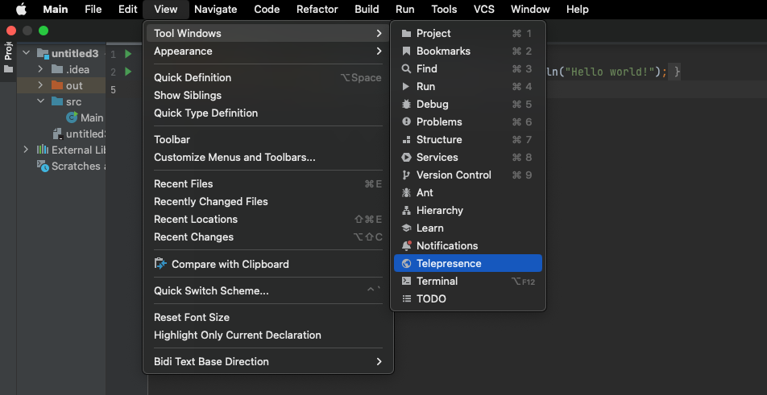
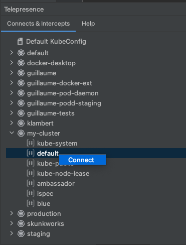
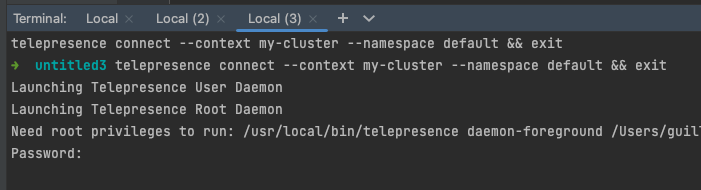
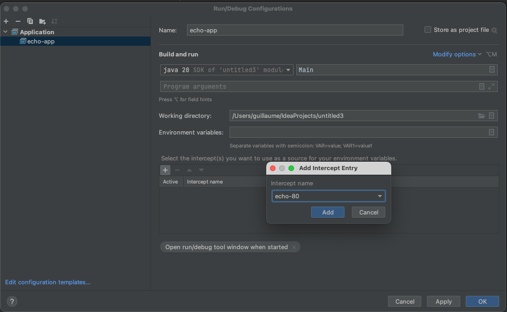
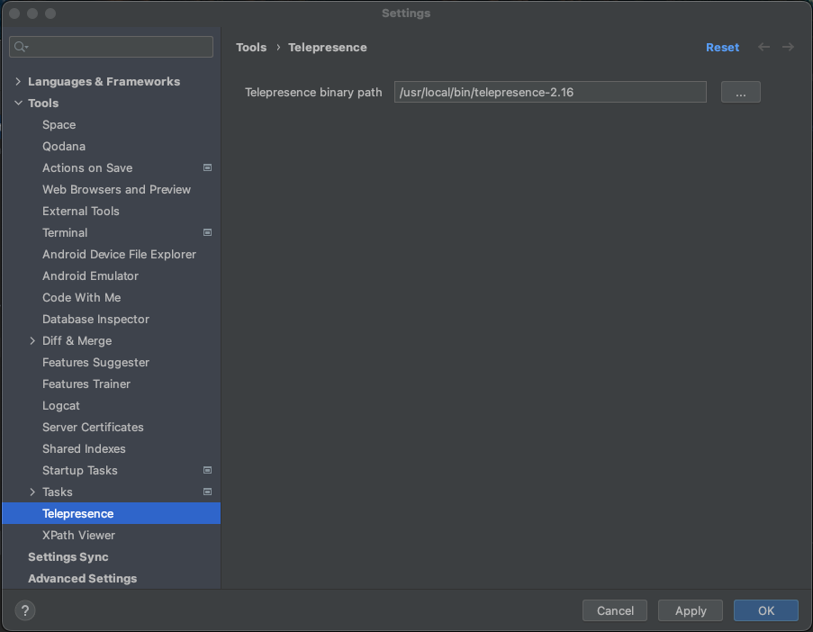

import Alert from '@material-ui/lab/Alert';

# Telepresence plugin for Jetbrains IDEs

The Telepresence plugin allows you to create your intercepts using a GUI, and integrate it with your workflow.

## Installation

<Alert severity="warning">
You need a CLI using 2.16 or higher, in its proprietary version.
</Alert>

You need to have the Telepresence command line installed on your machine. If that's not the case, [please proceed first](../../install/).

You can install the plugin directly from the [Jetbrains marketplace](https://plugins.jetbrains.com/search?search=telepresence), or from your 
IDE menu in **Settings > Plugins**.

Look for Telepresence, and click **Install**.

## Intercept your service

Start by opening the Telepresence tool menu:

  

Then you can select the context / namespace you want to connect to, and connect by using a right click:

  

If Telepresence wasn't running, it will open a terminal asking for your password.

  

## Run your application

Telepresence is also integrated with the Runner function of the IDE. 

To properly run in your cluster context, your code needs to be populated with the environment variables & volumes in use in the cluster. To achieve that, the plugin adds a tab in your language's runner to select the intercept to extract the environment variables from.

* Tick the checkbox to enable it, and specify the name of the intercept to use as a source.
* Start the runner, and the environment variables used by the real pod in your cluster should be available to your program.

  

## Settings

### Alternate Telepresence installation

If the plugin can't find your command line installation path, you can define another one in the IDE settings. Look for Telepresence, and select the binary you want to use.

  

Then click apply to save your changes.

